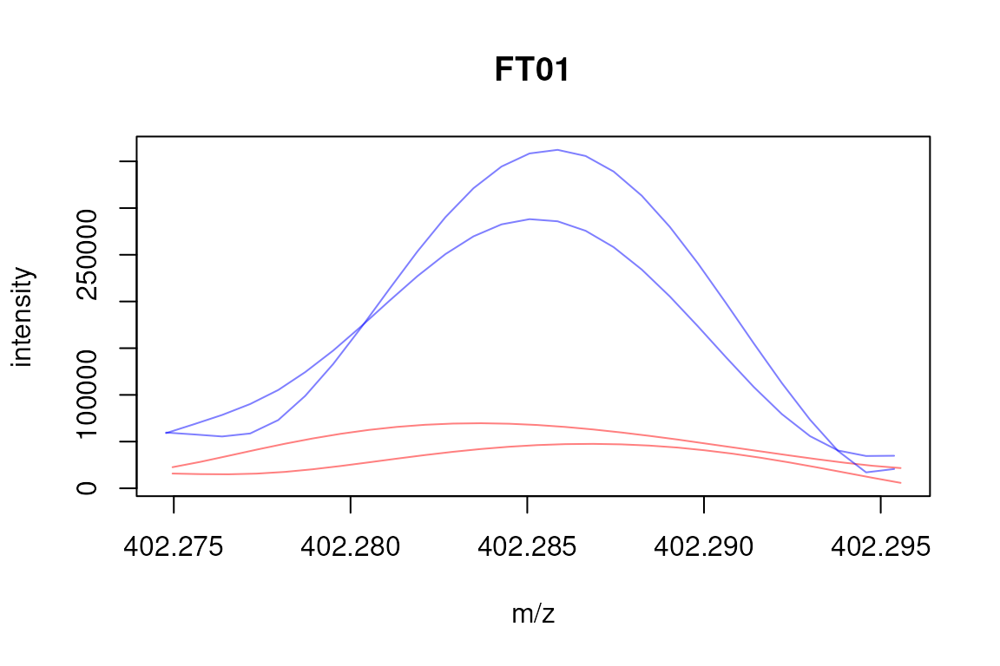

# Grouping FTICR-MS data with xcms

## Introduction

This document describes how to use
*[xcms](https://bioconductor.org/packages/3.23/xcms)* for the analysis
of direct injection mass spec data, including peak detection,
calibration and correspondence (grouping of peaks across samples).

## Peak detection

Prior to any other analysis step, peaks have to be identified in the
mass spec data. In contrast to the typical metabolomics workflow, in
which peaks are identified in the chromatographic (time) dimension, in
direct injection mass spec data sets peaks are identified in the m/z
dimension. *[xcms](https://bioconductor.org/packages/3.23/xcms)* uses
functionality from the *MassSpecWavelet* package to identify such peaks.

Below we load the required packages. For information on the parallel
processing setup please see the *BiocParallel* vignette.

``` r

library(MSnbase)
library(xcms)
library(MassSpecWavelet)
library(MsDataHub)
register(SerialParam())
```

In this documentation we use an example data set from the
`r Biocpkg("MsDataHub")` package. Assuming that
*[MsDataHub](https://bioconductor.org/packages/3.23/MsDataHub)* is
installed, it will obtain the files from
<https://doi.org/10.5281/zenodo.18494293> and load the data set. We
create also a `data.frame` describing the experimental setup based on
the file names.

``` r

## We're using 2 samples per condition
## from https://doi.org/10.5281/zenodo.18494293
mzML_files <- c(
  HAM004_641fE_14.11.07..Exp1.extracted.mzML(),
  HAM004_641fE_14.11.07..Exp2.extracted.mzML(),
  HAM005_641fE_14.11.07..Exp1.extracted.mzML(),
  HAM005_641fE_14.11.07..Exp2.extracted.mzML()
)

## Create a data.frame assigning samples to sample groups, i.e. ham4 and ham5.
grp <- c("ham4", "ham4", "ham5", "ham5")
pd <- data.frame(filename = basename(mzML_files), sample_group = grp)

## Load the data.
ham_raw <- readMSData(files = mzML_files,
                      pdata = AnnotatedDataFrame(pd),
                      mode = "onDisk")
```

    ## Warning in .testReadMSDataInput(environment()): Reading different file formats in.
    ## This is untested and you are welcome to try it out.
    ## Please report back!

The data files are from *direct injection* mass spectrometry
experiments, i.e. we have only a single spectrum available for each
sample and no retention times.

``` r

## Only a single spectrum with an *artificial* retention time is available
## for each sample
rtime(ham_raw)
```

    ## F1.S1 F2.S1 F3.S1 F4.S1 
    ##    -1    -1    -1    -1

Peaks are identified within each spectrum using the *mass spec wavelet*
method.

``` r

## Define the parameters for the peak detection
msw <- MSWParam(scales = c(1, 4, 9), nearbyPeak = TRUE, winSize.noise = 500,
                SNR.method = "data.mean", snthresh = 10)

ham_prep <- findChromPeaks(ham_raw, param = msw)

head(chromPeaks(ham_prep))
```

    ##            mz    mzmin    mzmax rt rtmin rtmax    into     maxo       sn intf
    ## CP01 403.2367 403.2279 403.2447 -1    -1    -1 4735258 372259.4 22.97534   NA
    ## CP02 409.1845 409.1747 409.1936 -1    -1    -1 4158404 310572.1 20.61382   NA
    ## CP03 413.2677 413.2585 413.2769 -1    -1    -1 6099006 435462.6 27.21723   NA
    ## CP04 423.2363 423.2266 423.2459 -1    -1    -1 2708391 174252.7 14.74527   NA
    ## CP05 427.2681 427.2574 427.2779 -1    -1    -1 6302089 461385.6 32.50050   NA
    ## CP06 437.2375 437.2254 437.2488 -1    -1    -1 7523070 517917.6 34.37645   NA
    ##           maxf sample
    ## CP01  814693.1      1
    ## CP02  732119.9      1
    ## CP03 1018994.8      1
    ## CP04  435858.5      1
    ## CP05 1125644.3      1
    ## CP06 1282906.5      1

## Calibration

The `calibrate` method can be used to correct the m/z values of
identified peaks. The currently implemented method requires identified
peaks and a list of m/z values for known calibrants. The identified
peaks m/z values are then adjusted based on the differences between the
calibrants’ m/z values and the m/z values of the closest peaks (within a
user defined permitted maximal distance). Note that this method does
presently only calibrate identified peaks, but not the original m/z
values in the spectra.

Below we demonstrate the `calibrate` method on one of the data files
with artificially defined calibration m/z values. We first subset the
data set to the first data file, extract the m/z values of 3 peaks and
modify the values slightly.

``` r

## Subset to the first file.
first_file <- filterFile(ham_prep, file = 1)

## Extract 3 m/z values
calib_mz <- chromPeaks(first_file)[c(1, 4, 7), "mz"]
calib_mz <- calib_mz + 0.00001 * runif(1, 0, 0.4) * calib_mz + 0.0001
```

Next we calibrate the data set using the previously defined *artificial*
calibrants. We are using the `"edgeshift"` method for calibration that
adjusts all peaks within the range of the m/z values of the calibrants
using a linear interpolation and shifts all chromatographic peaks
outside of that range by a constant factor (the difference between the
lowest respectively largest calibrant m/z with the closest peak’s m/z).
Note that in a *real* use case, the m/z values would obviously represent
known m/z of calibrants and would not be defined on the actual data.

``` r

## Set-up the parameter class for the calibration
prm <- CalibrantMassParam(mz = calib_mz, method = "edgeshift",
                          mzabs = 0.0001, mzppm = 5)
first_file_calibrated <- calibrate(first_file, param = prm)
```

To evaluate the calibration we plot below the difference between the
adjusted and raw m/z values (y-axis) against the raw m/z values.

``` r

diffs <- chromPeaks(first_file_calibrated)[, "mz"] -
    chromPeaks(first_file)[, "mz"]

plot(x = chromPeaks(first_file)[, "mz"], xlab = expression(m/z[raw]),
     y = diffs, ylab = expression(m/z[calibrated] - m/z[raw]))
```


## Correspondence

Correspondence aims to group peaks across samples to define the
*features* (ions with the same m/z values). Peaks from single spectrum,
direct injection MS experiments can be grouped with the *MZclust*
method. Below we perform the correspondence analysis with the
`groupChromPeaks` method using default settings.

``` r

## Using default settings but define sample group assignment
mzc_prm <- MzClustParam(sampleGroups = ham_prep$sample_group)
ham_prep <- groupChromPeaks(ham_prep, param = mzc_prm)
```

Getting an overview of the performed processings:

``` r

ham_prep
```

    ## MSn experiment data ("XCMSnExp")
    ## Object size in memory: 0.04 Mb
    ## - - - Spectra data - - -
    ##  MS level(s): 1 
    ##  Number of spectra: 4 
    ##  MSn retention times: -1:59 - -1:59 minutes
    ## - - - Processing information - - -
    ## Data loaded [Sun Jul  5 13:03:50 2026] 
    ##  MSnbase version: 2.37.0 
    ## - - - Meta data  - - -
    ## phenoData
    ##   rowNames: 1 2 3 4
    ##   varLabels: filename sample_group
    ##   varMetadata: labelDescription
    ## Loaded from:
    ##   [1] 3be765196f0_10386...  [4] 3be7c059423_10392
    ##   Use 'fileNames(.)' to see all files.
    ## protocolData: none
    ## featureData
    ##   featureNames: F1.S1 F2.S1 F3.S1 F4.S1
    ##   fvarLabels: fileIdx spIdx ... spectrum (36 total)
    ##   fvarMetadata: labelDescription
    ## experimentData: use 'experimentData(object)'
    ## - - - xcms preprocessing - - -
    ## Chromatographic peak detection:
    ##  method: MSW 
    ##  38 peaks identified in 4 samples.
    ##  On average 9.5 chromatographic peaks per sample.
    ## Correspondence:
    ##  method: mzClust 
    ##  20 features identified.
    ##  Median mz range of features: 9.1553e-05
    ##  Median rt range of features: 0

The peak group information, i.e. the *feature* definitions can be
accessed with the `featureDefinitions` method.

``` r

featureDefinitions(ham_prep)
```

    ## DataFrame with 20 rows and 10 columns
    ##          mzmed     mzmin     mzmax     rtmed     rtmin     rtmax    npeaks
    ##      <numeric> <numeric> <numeric> <numeric> <numeric> <numeric> <numeric>
    ## FT01   402.285   402.285   402.286        -1        -1        -1         2
    ## FT02   403.237   403.237   403.237        -1        -1        -1         4
    ## FT03   405.109   405.109   405.109        -1        -1        -1         2
    ## FT04   409.184   409.184   409.185        -1        -1        -1         2
    ## FT05   410.144   410.144   410.145        -1        -1        -1         2
    ## ...        ...       ...       ...       ...       ...       ...       ...
    ## FT16   437.238   437.238   437.238        -1        -1        -1         2
    ## FT17   438.240   438.240   438.240        -1        -1        -1         2
    ## FT18   439.151   439.151   439.151        -1        -1        -1         2
    ## FT19   441.130   441.130   441.131        -1        -1        -1         2
    ## FT20   445.293   445.292   445.293        -1        -1        -1         2
    ##           ham4      ham5     peakidx
    ##      <numeric> <numeric>      <list>
    ## FT01         0         2       16,28
    ## FT02         2         2 17,29,1,...
    ## FT03         0         2       18,30
    ## FT04         2         0        10,2
    ## FT05         0         2       19,31
    ## ...        ...       ...         ...
    ## FT16         2         0        6,13
    ## FT17         2         0        7,14
    ## FT18         0         2       26,37
    ## FT19         0         2       38,27
    ## FT20         2         0        15,8

Plotting the raw data for direct injection samples involves a little
more processing than for LC/GC-MS data in which we can simply use the
`chromatogram` method to extract the data. Below we extract the
m/z-intensity pairs for the peaks associated with the first feature. We
thus first identify the peaks for that feature and define their m/z
values range. Using this range we can subsequently use the `filterMz`
function to sub-set the full data set to the signal associated with the
feature’s peaks. On that object we can then call the `mz` and
`intensity` functions to extract the data.

``` r

## Get the peaks belonging to the first feature
pks <- chromPeaks(ham_prep)[featureDefinitions(ham_prep)$peakidx[[1]], ]

## Define the m/z range
mzr <- c(min(pks[, "mzmin"]) - 0.001, max(pks[, "mzmax"]) + 0.001)

## Subset the object to the m/z range
ham_prep_sub <- filterMz(ham_prep, mz = mzr)

## Extract the mz and intensity values
mzs <- mz(ham_prep_sub, bySample = TRUE)
ints <- intensity(ham_prep_sub, bySample = TRUE)

## Plot the data
plot(3, 3, pch = NA, xlim = range(mzs), ylim = range(ints), main = "FT01",
     xlab = "m/z", ylab = "intensity")
## Define colors
cols <- rep("#ff000080", length(mzs))
cols[ham_prep_sub$sample_group == "ham5"] <- "#0000ff80"
tmp <- mapply(mzs, ints, cols, FUN = function(x, y, col) {
    points(x, y, col = col, type = "l")
})
```



To access the actual intensity values of each feature in each sample the
`featureValue` method can be used. The setting `value = "into"` tells
the function to return the integrated signal for each peak (one
representative peak) per sample.

``` r

feat_vals <- featureValues(ham_prep, value = "into")
head(feat_vals)
```

    ##      3be765196f0_10386 3be72090e774_10387 3be73bdf6cb9_10391 3be7c059423_10392
    ## FT01                NA                 NA            4095293           4804763
    ## FT02           4735258            6202418            4811391           2581183
    ## FT03                NA                 NA            2982453           2268984
    ## FT04           4158404            5004546                 NA                NA
    ## FT05                NA                 NA            2872023           2133219
    ## FT06           6099006            4950642                 NA                NA

`NA` is reported for features in samples for which no peak was
identified at the feature’s m/z value. In some instances there might
still be a signal at the feature’s position in the raw data files, but
the peak detection failed to identify a peak. For these cases signal can
be recovered using the `fillChromPeaks` method that integrates all raw
signal at the feature’s location. If there is no signal at that location
an `NA` is reported.

``` r

ham_prep <- fillChromPeaks(ham_prep, param = FillChromPeaksParam())

head(featureValues(ham_prep, value = "into"))
```

    ##      3be765196f0_10386 3be72090e774_10387 3be73bdf6cb9_10391 3be7c059423_10392
    ## FT01          768754.0          1230140.4            4095293         4804762.5
    ## FT02         4735257.5          6202417.6            4811391         2581183.1
    ## FT03          652566.6           374109.9            2982453         2268984.5
    ## FT04         4158404.5          5004546.3            1221031         1241294.4
    ## FT05          652201.1           403448.4            2872023         2133219.4
    ## FT06         6099006.3          4950641.7            1573988          977694.5

## Further analysis

Further analysis, i.e. detection of features/metabolites with
significantly different abundances, or PCA analyses can be performed on
the feature matrix using functionality from other R packages, such as
*[limma](https://bioconductor.org/packages/3.23/limma)*.

## Session information

``` r

sessionInfo()
```

    ## R version 4.6.0 (2026-04-24)
    ## Platform: x86_64-pc-linux-gnu
    ## Running under: Ubuntu 24.04.4 LTS
    ## 
    ## Matrix products: default
    ## BLAS:   /usr/lib/x86_64-linux-gnu/openblas-pthread/libblas.so.3 
    ## LAPACK: /usr/lib/x86_64-linux-gnu/openblas-pthread/libopenblasp-r0.3.26.so;  LAPACK version 3.12.0
    ## 
    ## locale:
    ##  [1] LC_CTYPE=en_US.UTF-8       LC_NUMERIC=C              
    ##  [3] LC_TIME=en_US.UTF-8        LC_COLLATE=en_US.UTF-8    
    ##  [5] LC_MONETARY=en_US.UTF-8    LC_MESSAGES=en_US.UTF-8   
    ##  [7] LC_PAPER=en_US.UTF-8       LC_NAME=C                 
    ##  [9] LC_ADDRESS=C               LC_TELEPHONE=C            
    ## [11] LC_MEASUREMENT=en_US.UTF-8 LC_IDENTIFICATION=C       
    ## 
    ## time zone: UTC
    ## tzcode source: system (glibc)
    ## 
    ## attached base packages:
    ## [1] stats4    stats     graphics  grDevices utils     datasets  methods  
    ## [8] base     
    ## 
    ## other attached packages:
    ##  [1] MsDataHub_1.12.0       MassSpecWavelet_1.78.0 xcms_4.11.1           
    ##  [4] BiocParallel_1.46.0    MSnbase_2.37.0         ProtGenerics_1.44.0   
    ##  [7] S4Vectors_0.50.1       mzR_2.46.0             Rcpp_1.1.1-1.1        
    ## [10] Biobase_2.72.0         BiocGenerics_0.58.1    generics_0.1.4        
    ## [13] BiocStyle_2.40.0      
    ## 
    ## loaded via a namespace (and not attached):
    ##   [1] RColorBrewer_1.1-3          jsonlite_2.0.0             
    ##   [3] MultiAssayExperiment_1.38.0 magrittr_2.0.5             
    ##   [5] farver_2.1.2                MALDIquant_1.22.3          
    ##   [7] rmarkdown_2.31              fs_2.1.0                   
    ##   [9] ragg_1.5.2                  vctrs_0.7.3                
    ##  [11] memoise_2.0.1               htmltools_0.5.9            
    ##  [13] S4Arrays_1.12.0             progress_1.2.3             
    ##  [15] AnnotationHub_4.2.2         curl_7.1.0                 
    ##  [17] signal_1.8-1                SparseArray_1.12.2         
    ##  [19] mzID_1.50.0                 sass_0.4.10                
    ##  [21] bslib_0.11.0                htmlwidgets_1.6.4          
    ##  [23] desc_1.4.3                  plyr_1.8.9                 
    ##  [25] httr2_1.2.2                 impute_1.86.0              
    ##  [27] cachem_1.1.0                igraph_2.3.2               
    ##  [29] lifecycle_1.0.5             iterators_1.0.14           
    ##  [31] pkgconfig_2.0.3             Matrix_1.7-5               
    ##  [33] R6_2.6.1                    fastmap_1.2.0              
    ##  [35] MatrixGenerics_1.24.0       clue_0.3-68                
    ##  [37] digest_0.6.39               pcaMethods_2.4.0           
    ##  [39] AnnotationDbi_1.74.0        ExperimentHub_3.2.0        
    ##  [41] textshaping_1.0.5           GenomicRanges_1.64.0       
    ##  [43] RSQLite_3.53.2              filelock_1.0.3             
    ##  [45] Spectra_1.22.2              httr_1.4.8                 
    ##  [47] abind_1.4-8                 compiler_4.6.0             
    ##  [49] withr_3.0.3                 bit64_4.8.2                
    ##  [51] doParallel_1.0.17           S7_0.2.2                   
    ##  [53] PTMods_1.0.0                DBI_1.3.0                  
    ##  [55] MASS_7.3-65                 MsExperiment_1.14.0        
    ##  [57] rappdirs_0.3.4              DelayedArray_0.38.2        
    ##  [59] tools_4.6.0                 PSMatch_1.16.0             
    ##  [61] otel_0.2.0                  glue_1.8.1                 
    ##  [63] QFeatures_1.22.0            grid_4.6.0                 
    ##  [65] cluster_2.1.8.2             reshape2_1.4.5             
    ##  [67] gtable_0.3.6                preprocessCore_1.74.0      
    ##  [69] tidyr_1.3.2                 data.table_1.18.4          
    ##  [71] hms_1.1.4                   MetaboCoreUtils_1.20.1     
    ##  [73] XVector_0.52.0              BiocVersion_3.23.1         
    ##  [75] foreach_1.5.2               pillar_1.11.1              
    ##  [77] stringr_1.6.0               limma_3.68.4               
    ##  [79] dplyr_1.2.1                 BiocFileCache_3.2.0        
    ##  [81] lattice_0.22-9              bit_4.6.0                  
    ##  [83] tidyselect_1.2.1            Biostrings_2.80.1          
    ##  [85] knitr_1.51                  bookdown_0.47              
    ##  [87] IRanges_2.46.0              Seqinfo_1.2.0              
    ##  [89] SummarizedExperiment_1.42.0 xfun_0.59                  
    ##  [91] statmod_1.5.2               matrixStats_1.5.0          
    ##  [93] stringi_1.8.7               lazyeval_0.2.3             
    ##  [95] yaml_2.3.12                 evaluate_1.0.5             
    ##  [97] codetools_0.2-20            MsCoreUtils_1.24.0         
    ##  [99] tibble_3.3.1                BiocManager_1.30.27        
    ## [101] cli_3.6.6                   affyio_1.82.0              
    ## [103] systemfonts_1.3.2           jquerylib_0.1.4            
    ## [105] dbplyr_2.6.0                png_0.1-9                  
    ## [107] XML_3.99-0.23               parallel_4.6.0             
    ## [109] pkgdown_2.2.0.9000          ggplot2_4.0.3              
    ## [111] blob_1.3.0                  prettyunits_1.2.0          
    ## [113] AnnotationFilter_1.36.0     MsFeatures_1.20.0          
    ## [115] scales_1.4.0                affy_1.90.0                
    ## [117] ncdf4_1.24                  purrr_1.2.2                
    ## [119] crayon_1.5.3                rlang_1.2.0                
    ## [121] vsn_3.80.0                  KEGGREST_1.52.2
