# Plotting xcms results using lcmsPlot

**Package**: *[xcms](https://bioconductor.org/packages/3.24/xcms)*\
**Authors**: Ossama Edbali, Johannes Rainer\
**Modified**: 2026-10-06 07:39:14.62411\
**Compiled**: Tue Oct 6 08:28:50 2026

## Introduction

Visualization of mass spectrometry data is an important component of
LC-MS data analysis, both for quality control and for interpretation and
communication of results. Throughout a metabolomics or proteomics
workflow, visualization can help identify problems with data acquisition
and processing, such as retention-time shifts, signal drift, differences
in signal intensity between samples, and incorrect or poorly defined
chromatographic peaks. It also provides an essential means of inspecting
detected features and communicating results.

*xcms* provides a range of visualization functions for inspecting LC-MS
data and the results of chromatographic peak detection, retention-time
correction, and feature definition. These functions cover many common
quality-control and diagnostic use cases and are closely integrated with
the *xcms* data structures and processing workflow. For more complex
visualizations, however, users may benefit from the flexibility of the
*ggplot2* grammar of graphics, particularly when combining multiple
samples, annotations, experimental metadata, or several graphical layers
into a single figure.

*[lcmsPlot](https://bioconductor.org/packages/3.24/lcmsPlot)* has been
developed to facilitate the visualization of LC-MS raw and processed
data in a consistent and flexible manner across different software tools
and processing workflows. By providing a common *ggplot2*-based
framework for LC-MS visualization, it enables users to apply a
consistent graphical approach to data generated or processed by
different packages and at different stages of an analysis workflow.

This vignette illustrates how *lcmsPlot* can be used together with
*xcms* to generate flexible, reproducible, and publication-ready
visualizations of LC-MS data.

For a more thorough description of the package, including its support
for raw files and for the outputs of other LC-MS software, see the
[lcmsPlot
vignette](https://bioconductor.org/packages/release/bioc/vignettes/lcmsPlot/inst/doc/lcms_data_plotting.html).

## Load the packages

*lcmsPlot* is a Bioconductor package and can be installed with
*[BiocManager](https://CRAN.R-project.org/package=BiocManager)*:

\
`if`` ``(``!`[`requireNamespace`](https://rdrr.io/r/base/ns-load.html)`(``"BiocManager"``, quietly ``=`` ``TRUE``)``)`\
`    `[`install.packages`](https://rdrr.io/r/utils/install.packages.html)`(``"BiocManager"``)`\
`BiocManager``::`[`install`](https://bioconductor.github.io/BiocManager/reference/install.html)`(``"lcmsPlot"``)`

\
[`library`](https://rdrr.io/r/base/library.html)`(`[`xcms`](https://github.com/sneumann/xcms)`)`\
[`library`](https://rdrr.io/r/base/library.html)`(`[`lcmsPlot`](https://github.com/computational-metabolomics/lcmsPlot)`)`

## Load the data

Throughout this vignette we use the preprocessing result that is shipped
with *xcms* and that is described in detail in the main [xcms
vignette](https://bioconductor.org/packages/release/bioc/vignettes/xcms/inst/doc/xcms.html).
It is derived from a subset of the data from \[1\]; the raw files are
provided by the *faahKO* package.

Using
[`loadXcmsData()`](https://sneumann.github.io/xcms/reference/loadXcmsData.md)
we get the fully preprocessed object directly, so that chromatographic
peak detection, alignment and correspondence do not have to be repeated
here.

\
`xdata`` ``<-`` `[`loadXcmsData`](https://sneumann.github.io/xcms/reference/loadXcmsData.md)`(``"xdata"``)`

The object contains eight samples assigned to the two sample groups
`"KO"` and `"WT"`:

\
`Biobase``::`[`pData`](https://rdrr.io/pkg/Biobase/man/phenoData.html)`(``xdata``)`

    ##   sample_name sample_group sample_type
    ## 1        ko15           KO          QC
    ## 2        ko16           KO       study
    ## 3        ko21           KO       study
    ## 4        ko22           KO          QC
    ## 5        wt15           WT       study
    ## 6        wt16           WT       study
    ## 7        wt21           WT          QC
    ## 8        wt22           WT       study

## Plot samples summaries

Base peak chromatograms, total ion chromatograms, and total ion current
plots are useful in LC-MS because they simplify complex datasets,
highlight the most intense signals, and enable rapid detection and
comparison of chromatographic features.

In the examples below we plot the base peak and total ion chromatograms
for the eight samples (faceted):

\
[`lcmsPlot`](https://rdrr.io/pkg/lcmsPlot/man/lcmsPlot.html)`(``xdata``, sample_id_column ``=`` ``"sample_name"``)`` ``+`\
`    `[`lp_chromatogram`](https://rdrr.io/pkg/lcmsPlot/man/lp_chromatogram.html)`(``aggregation_fun ``=`` ``"max"``)`` ``+`\
`    `[`lp_facets`](https://rdrr.io/pkg/lcmsPlot/man/lp_facets.html)`(``facets ``=`` ``"sample_name"``, ncol ``=`` ``4``)`

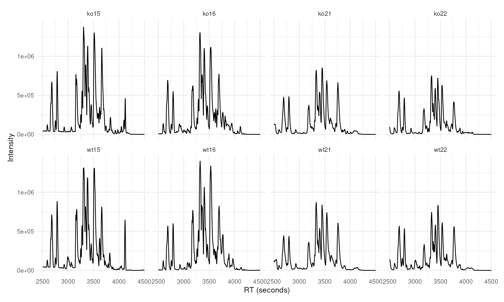

\
[`lcmsPlot`](https://rdrr.io/pkg/lcmsPlot/man/lcmsPlot.html)`(``xdata``, sample_id_column ``=`` ``"sample_name"``)`` ``+`\
`    `[`lp_chromatogram`](https://rdrr.io/pkg/lcmsPlot/man/lp_chromatogram.html)`(``aggregation_fun ``=`` ``"sum"``)`` ``+`\
`    `[`lp_facets`](https://rdrr.io/pkg/lcmsPlot/man/lp_facets.html)`(``facets ``=`` ``"sample_name"``, ncol ``=`` ``4``)`

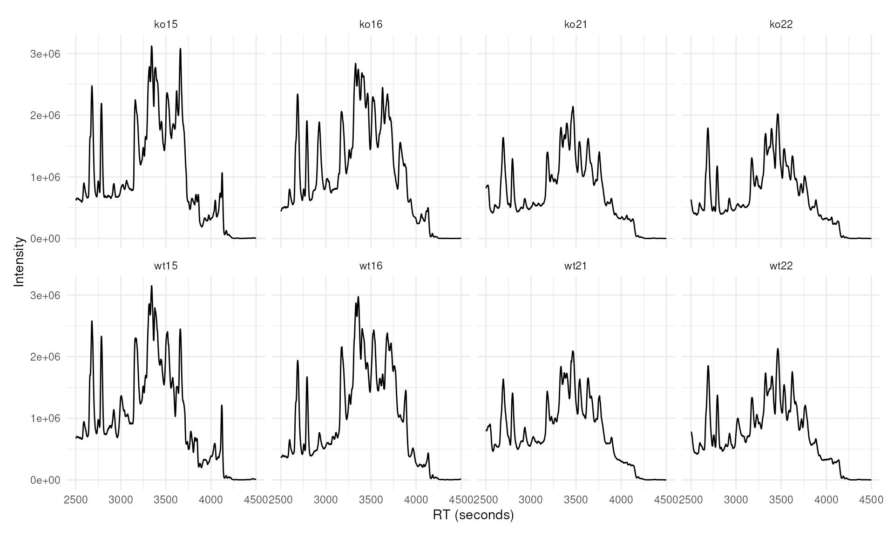

We can also plot multiple chromatograms in the same plot, overlapped. In
the example below, base peak chromatograms are computed for each sample,
grouped by sample group, and displayed together in one panel.

\
[`lcmsPlot`](https://rdrr.io/pkg/lcmsPlot/man/lcmsPlot.html)`(``xdata``, sample_id_column ``=`` ``"sample_name"``)`` ``+`\
`    `[`lp_chromatogram`](https://rdrr.io/pkg/lcmsPlot/man/lp_chromatogram.html)`(``aggregation_fun ``=`` ``"max"``)`` ``+`\
`    `[`lp_arrange`](https://rdrr.io/pkg/lcmsPlot/man/lp_arrange.html)`(``group_by ``=`` ``"sample_group"``)`` ``+`\
`    `[`lp_labels`](https://rdrr.io/pkg/lcmsPlot/man/lp_labels.html)`(``title ``=`` ``"Base peak chromatograms"``, legend ``=`` ``"Sample group"``)`` ``+`\
`    `[`lp_legend`](https://rdrr.io/pkg/lcmsPlot/man/lp_legend.html)`(``position ``=`` ``"bottom"``)`

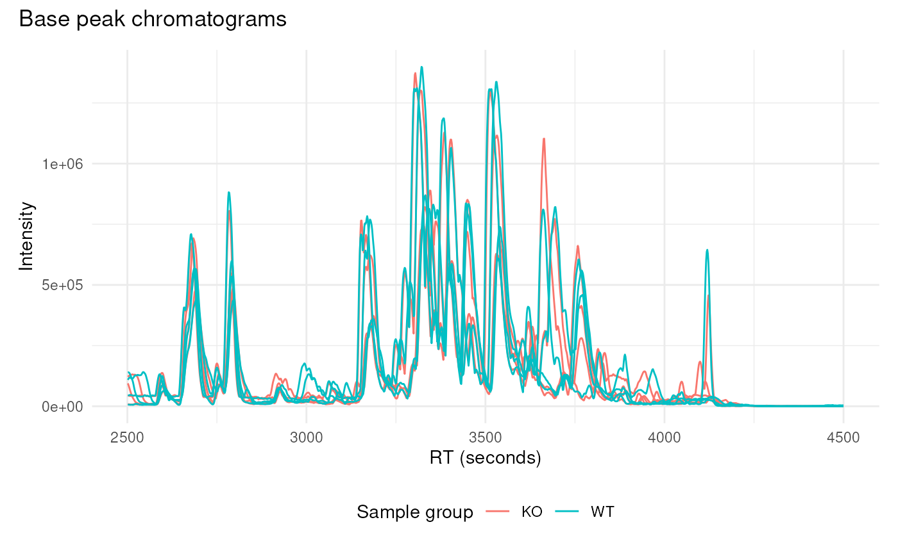

Below, we generate a total ion current plot for the eight samples under
consideration:

\
[`lcmsPlot`](https://rdrr.io/pkg/lcmsPlot/man/lcmsPlot.html)`(``xdata``, sample_id_column ``=`` ``"sample_name"``)`` ``+`\
`    `[`lp_total_ion_current`](https://rdrr.io/pkg/lcmsPlot/man/lp_total_ion_current.html)`(``type ``=`` ``"violin"``)`` ``+`\
`    `[`lp_arrange`](https://rdrr.io/pkg/lcmsPlot/man/lp_arrange.html)`(``group_by ``=`` ``"sample_group"``)`` ``+`\
`    `[`lp_labels`](https://rdrr.io/pkg/lcmsPlot/man/lp_labels.html)`(``title ``=`` ``"Total ion current"``, legend ``=`` ``"Sample group"``)`

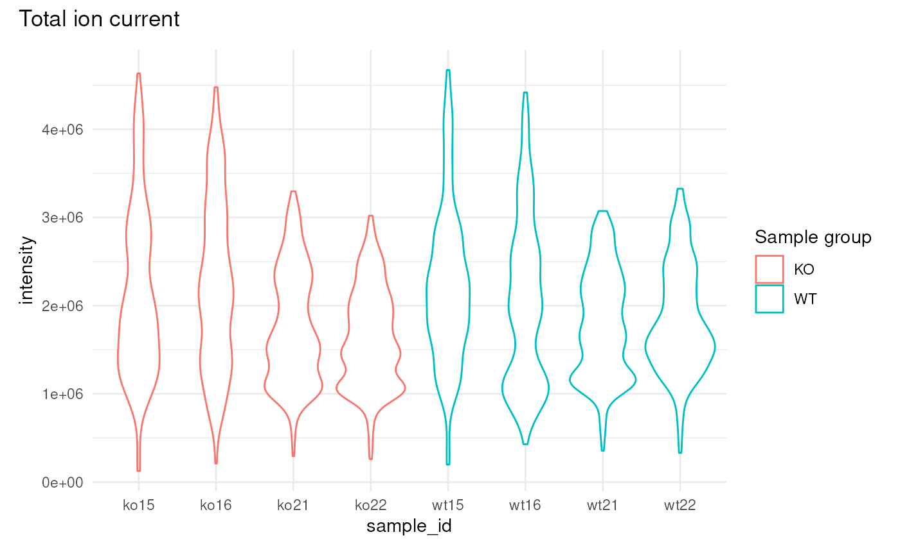

These plots show the overall amount of ion signal entering the detector
at any moment, widely used for quality control and method assessment.

## Plot extracted ion chromatograms

\
[`lcmsPlot`](https://rdrr.io/pkg/lcmsPlot/man/lcmsPlot.html)`(``xdata``, sample_id_column ``=`` ``"sample_name"``)`` ``+`\
`    `[`lp_chromatogram`](https://rdrr.io/pkg/lcmsPlot/man/lp_chromatogram.html)`(``features ``=`` `[`rbind`](https://rdrr.io/r/base/cbind.html)`(`[`c`](https://rdrr.io/r/base/c.html)`(`\
`        mzmin ``=`` ``334.9``,`\
`        mzmax ``=`` ``335.1``,`\
`        rtmin ``=`` ``2700``,`\
`        rtmax ``=`` ``2900``)``)``)`` ``+`\
`    `[`lp_arrange`](https://rdrr.io/pkg/lcmsPlot/man/lp_arrange.html)`(``group_by ``=`` ``"sample_group"``)`` ``+`\
`    `[`lp_labels`](https://rdrr.io/pkg/lcmsPlot/man/lp_labels.html)`(``legend ``=`` ``"Sample group"``)`

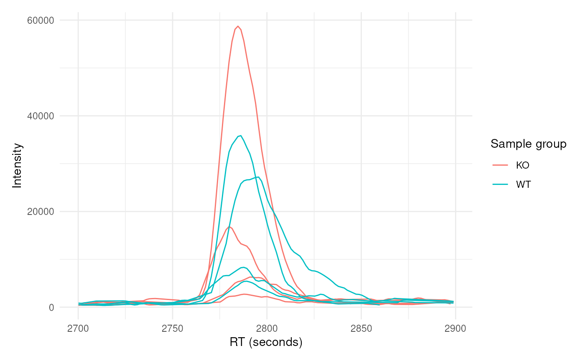

The above plot can be gridded on metadata factors; in the plot below we
arrange `feature_id` along the rows and `sample_id` along the columns
with [`lp_grid()`](https://rdrr.io/pkg/lcmsPlot/man/lp_grid.html), and
detected chromatographic peaks are highlighted using the
`highlight_peaks` parameter:

\
[`lcmsPlot`](https://rdrr.io/pkg/lcmsPlot/man/lcmsPlot.html)`(``xdata``, sample_id_column ``=`` ``'sample_name'``)`` ``+`\
`    `[`lp_chromatogram`](https://rdrr.io/pkg/lcmsPlot/man/lp_chromatogram.html)`(`\
`        features ``=`` `[`rbind`](https://rdrr.io/r/base/cbind.html)`(`\
`            mz334 ``=`` `[`c`](https://rdrr.io/r/base/c.html)`(`\
`                mzmin ``=`` ``334.9``, mzmax ``=`` ``335.1``,`\
`                rtmin ``=`` ``2700``, rtmax ``=`` ``2900``)``,`\
`            mz278 ``=`` `[`c`](https://rdrr.io/r/base/c.html)`(`\
`                mzmin ``=`` ``278.99721``, mzmax ``=`` ``279.00279``,`\
`                rtmin ``=`` ``2740``, rtmax ``=`` ``2840``)`\
`        ``)``,`\
`        highlight_peaks ``=`` ``TRUE``,`\
`        highlight_peaks_color ``=`` ``'#f00'``)`` ``+`\
`    `[`lp_grid`](https://rdrr.io/pkg/lcmsPlot/man/lp_grid.html)`(``rows ``=`` ``'feature_id'``, cols ``=`` ``'sample_id'``, free_y ``=`` ``TRUE``)`

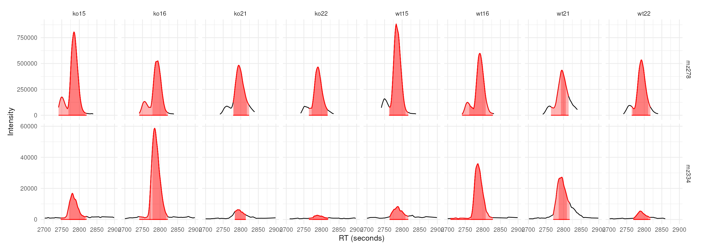

### The same plot with base R graphics

The same figure can be produced with the plotting functions of *xcms*
itself. The extracted ion chromatograms are first created with the
[`chromatogram()`](https://sneumann.github.io/xcms/reference/chromatogram-method.md)
function, which returns an `XChromatograms` object with one chromatogram
per feature (row) and sample (column), and the detected chromatographic
peaks attached to each of them.

\
`mzr_xic`` ``<-`` `[`rbind`](https://rdrr.io/r/base/cbind.html)`(`[`c`](https://rdrr.io/r/base/c.html)`(``334.9``, ``335.1``)``, `[`c`](https://rdrr.io/r/base/c.html)`(``278.99721``, ``279.00279``)``)`\
`rtr_xic`` ``<-`` `[`rbind`](https://rdrr.io/r/base/cbind.html)`(`[`c`](https://rdrr.io/r/base/c.html)`(``2700``, ``2900``)``, `[`c`](https://rdrr.io/r/base/c.html)`(``2740``, ``2840``)``)`\
\
`chrs_xic`` ``<-`` `[`chromatogram`](https://sneumann.github.io/xcms/reference/chromatogram-method.md)`(``xdata``, mz ``=`` ``mzr_xic``, rt ``=`` ``rtr_xic``)`\
\
`## Define one color per sample group`\
`group_colors`` ``<-`` ``RColorBrewer``::`[`brewer.pal`](https://rdrr.io/pkg/RColorBrewer/man/ColorBrewer.html)`(``3``, ``"Set1"``)``[``1``:``2``]`\
[`names`](https://rdrr.io/r/base/names.html)`(``group_colors``)`` ``<-`` `[`c`](https://rdrr.io/r/base/c.html)`(``"KO"``, ``"WT"``)`\
`sample_colors`` ``<-`` ``group_colors``[``chrs_xic``$``sample_group``]`\
\
`## Label the rows the same way lcmsPlot names its features`\
`feature_ids`` ``<-`` `[`sprintf`](https://rdrr.io/r/base/sprintf.html)`(``"M%dT%d"``, `[`round`](https://rdrr.io/r/base/Round.html)`(`[`rowMeans`](https://rdrr.io/r/base/colSums.html)`(``mzr_xic``)``)``,`\
`                       `[`round`](https://rdrr.io/r/base/Round.html)`(`[`rowMeans`](https://rdrr.io/r/base/colSums.html)`(``rtr_xic``)``)``)`\
\
`## One panel per feature (row) and sample (column)`\
[`par`](https://rdrr.io/r/graphics/par.html)`(``mfrow ``=`` `[`c`](https://rdrr.io/r/base/c.html)`(`[`nrow`](https://rdrr.io/r/base/nrow.html)`(``chrs_xic``)``, `[`ncol`](https://rdrr.io/r/base/nrow.html)`(``chrs_xic``)``)``,`\
`    mar ``=`` `[`c`](https://rdrr.io/r/base/c.html)`(``3``, ``3``, ``1.8``, ``0.4``)``, mgp ``=`` `[`c`](https://rdrr.io/r/base/c.html)`(``1.9``, ``0.6``, ``0``)``, cex ``=`` ``0.7``)`\
`for`` ``(``i`` ``in`` `[`seq_len`](https://rdrr.io/r/base/seq.html)`(`[`nrow`](https://rdrr.io/r/base/nrow.html)`(``chrs_xic``)``)``)`` ``{`\
`    ``for`` ``(``j`` ``in`` `[`seq_len`](https://rdrr.io/r/base/seq.html)`(`[`ncol`](https://rdrr.io/r/base/nrow.html)`(``chrs_xic``)``)``)`` ``{`\
`        `[`plot`](https://rdrr.io/r/base/plot.html)`(``chrs_xic``[``i``, ``j``]``, col ``=`` ``sample_colors``[``j``]``,`\
`             peakType ``=`` ``"polygon"``, peakCol ``=`` `[`paste0`](https://rdrr.io/r/base/paste.html)`(``sample_colors``[``j``]``, ``60``)``,`\
`             peakBg ``=`` `[`paste0`](https://rdrr.io/r/base/paste.html)`(``sample_colors``[``j``]``, ``40``)``,`\
`             main ``=`` `[`paste`](https://rdrr.io/r/base/paste.html)`(``feature_ids``[``i``]``, ``chrs_xic``$``sample_name``[``j``]``)``)`\
`    ``}`\
`}`

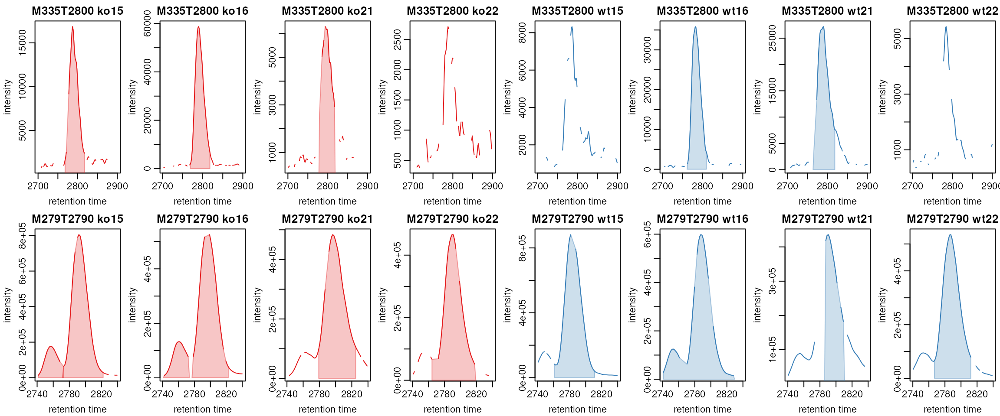

The result is equivalent to the
[`lp_grid()`](https://rdrr.io/pkg/lcmsPlot/man/lp_grid.html) figure
above, but the layout has to be set up explicitly: `par(mfrow = ...)`
defines the grid, the two nested loops address the individual cells
`chrs_xic[i, j]` of the `XChromatograms` object, and the panel titles
and per-sample colors have to be assembled by hand. Each panel also
keeps its own y axis, which corresponds to `free_y = TRUE` in
[`lp_grid()`](https://rdrr.io/pkg/lcmsPlot/man/lp_grid.html).

In *lcmsPlot*, you can also plot directly from an `XChromatograms`
object. In the example below, two features are defined by their m/z
ranges and the corresponding retention time windows. The resulting plot
is arranged as a grid with features as rows and samples as columns.

\
`mzr`` ``<-`` `[`matrix`](https://rdrr.io/r/base/matrix.html)`(`[`c`](https://rdrr.io/r/base/c.html)`(``344``, ``344``, ``360``, ``360``)``, ncol ``=`` ``2``, byrow ``=`` ``TRUE``)`\
\
`rtr`` ``<-`` `[`matrix`](https://rdrr.io/r/base/matrix.html)`(`[`c`](https://rdrr.io/r/base/c.html)`(``2500``, ``2880``, ``2600``, ``2880``)``, ncol ``=`` ``2``, byrow ``=`` ``TRUE``)`\
\
`chrs`` ``<-`` `[`chromatogram`](https://sneumann.github.io/xcms/reference/chromatogram-method.md)`(``xdata``, mz ``=`` ``mzr``, rt ``=`` ``rtr``)`\
[`rownames`](https://rdrr.io/r/base/colnames.html)`(``chrs``)`` ``<-`` `[`c`](https://rdrr.io/r/base/c.html)`(``"mz344"``, ``"mz360"``)`\
\
[`lcmsPlot`](https://rdrr.io/pkg/lcmsPlot/man/lcmsPlot.html)`(``chrs``)`` ``+`\
`    `[`lp_chromatogram`](https://rdrr.io/pkg/lcmsPlot/man/lp_chromatogram.html)`(``na.rm ``=`` ``TRUE``)`` ``+`\
`    `[`lp_grid`](https://rdrr.io/pkg/lcmsPlot/man/lp_grid.html)`(``rows ``=`` ``"feature_id"``, cols ``=`` ``"sample_id"``)`

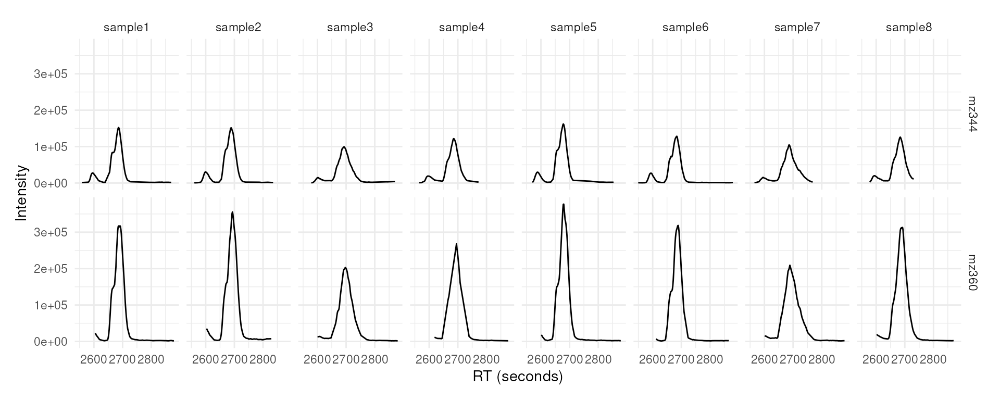

## Quality control of peak detection

[`lp_peak_count_image()`](https://rdrr.io/pkg/lcmsPlot/man/lp_peak_count_image.html)
bins the retention-time axis and shows how many chromatographic peaks
each sample yielded in each bin, with samples on the y axis and one tile
per sample and bin. It is the counterpart of
[`xcms::plotChromPeakImage()`](https://sneumann.github.io/xcms/reference/plotChromPeaks.md).

\
[`lcmsPlot`](https://rdrr.io/pkg/lcmsPlot/man/lcmsPlot.html)`(``xdata``, sample_id_column ``=`` ``"sample_name"``)`` ``+`\
`    `[`lp_peak_count_image`](https://rdrr.io/pkg/lcmsPlot/man/lp_peak_count_image.html)`(``bin_size ``=`` ``30``)`` ``+`\
`    `[`lp_labels`](https://rdrr.io/pkg/lcmsPlot/man/lp_labels.html)`(``title ``=`` ``"Chromatographic peaks per 30 s bin"``)`

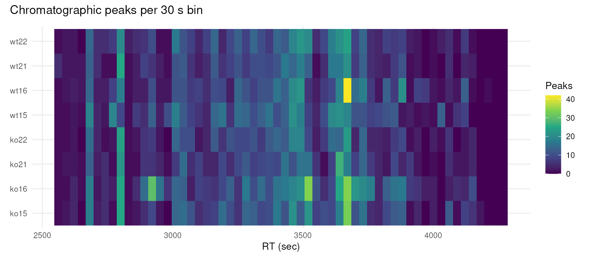

[`lp_chrom_peak_rects()`](https://rdrr.io/pkg/lcmsPlot/man/lp_chrom_peak_rects.html)
draws one rectangle per detected peak, spanning its retention-time
limits by its m/z limits, and shows where in the m/z / retention-time
plane the peak detection actually placed its boundaries.

\
[`lcmsPlot`](https://rdrr.io/pkg/lcmsPlot/man/lcmsPlot.html)`(``xdata``, sample_id_column ``=`` ``"sample_name"``)`` ``+`\
`    `[`lp_chrom_peak_rects`](https://rdrr.io/pkg/lcmsPlot/man/lp_chrom_peak_rects.html)`(`\
`        sample_ids ``=`` `[`c`](https://rdrr.io/r/base/c.html)`(``"ko15"``, ``"wt15"``)``,`\
`        rt_range ``=`` `[`c`](https://rdrr.io/r/base/c.html)`(``3200``, ``3700``)``,`\
`        mz_range ``=`` `[`c`](https://rdrr.io/r/base/c.html)`(``480``, ``540``)``,`\
`        fill ``=`` ``"#c0392b60"``)`

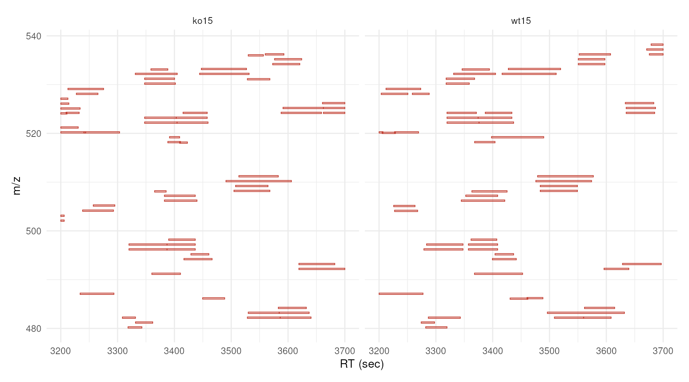

## Plot grouped peaks across samples (features)

The correspondence analysis performed on this data set grouped the
chromatographic peaks of the individual samples into *features*,
i.e. groups of peaks that likely originate from the same ion. Each
feature is identified by the corresponding row name of
`featureDefinitions(xdata)`, by default `"FT001"`, `"FT002"`, and so on.
These identifiers can be passed to the `features` parameter of
[`lp_chromatogram()`](https://rdrr.io/pkg/lcmsPlot/man/lp_chromatogram.html)
to extract and plot the corresponding chromatograms across all samples
without having to specify m/z and retention time ranges manually. The
`ppm` and `rt_tol` parameters define how far around the feature’s
consensus m/z and retention time the signal is extracted.

\
[`lcmsPlot`](https://rdrr.io/pkg/lcmsPlot/man/lcmsPlot.html)`(``xdata``, sample_id_column ``=`` ``'sample_name'``)`` ``+`\
`    `[`lp_chromatogram`](https://rdrr.io/pkg/lcmsPlot/man/lp_chromatogram.html)`(`\
`        features ``=`` `[`c`](https://rdrr.io/r/base/c.html)`(``'FT002'``, ``'FT004'``, ``'FT019'``, ``'FT027'``)``,`\
`        ppm ``=`` ``10``,`\
`        rt_tol ``=`` ``80``,`\
`        highlight_peaks ``=`` ``TRUE``,`\
`        highlight_peaks_factor ``=`` ``"sample_group"``)`` ``+`\
`    `[`lp_arrange`](https://rdrr.io/pkg/lcmsPlot/man/lp_arrange.html)`(``group_by ``=`` ``'sample_group'``)`` ``+`\
`    `[`lp_facets`](https://rdrr.io/pkg/lcmsPlot/man/lp_facets.html)`(``facets ``=`` ``'feature_id'``, ncol ``=`` ``2``, free_x ``=`` ``TRUE``, free_y ``=`` ``TRUE``)`` ``+`\
`    `[`lp_labels`](https://rdrr.io/pkg/lcmsPlot/man/lp_labels.html)`(``title ``=`` ``"Four selected features"``, legend ``=`` ``"Sample"``)`` ``+`\
`    `[`lp_legend`](https://rdrr.io/pkg/lcmsPlot/man/lp_legend.html)`(``position ``=`` ``"bottom"``)`

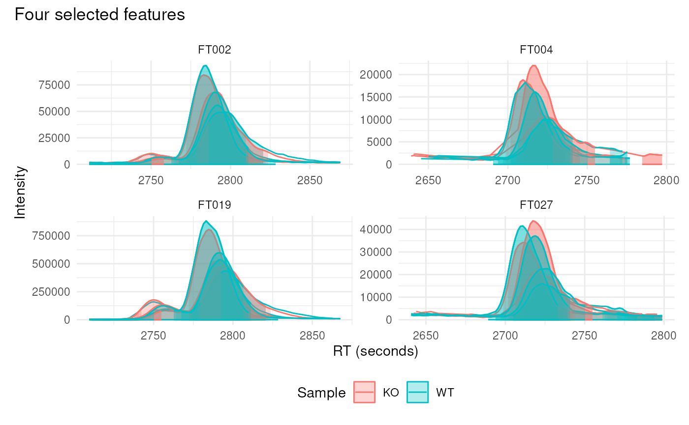

### Plot peak density alongside chromatograms

Peak density plots show how the detected chromatographic peaks of an m/z
window are distributed along the retention time axis. Each detected peak
is drawn as a point at the y position of its sample and the kernel
density estimate of the peak apex retention times is overlaid as a line.
This is the diagnostic used by the peak density correspondence method
and makes it easy to judge whether the peaks of the different samples
are well aligned and whether a feature is tightly defined. It is the
*lcmsPlot* counterpart of
[`xcms::plotChromPeakDensity()`](https://sneumann.github.io/xcms/reference/plotChromPeakDensity.md).

When
[`lp_peak_density()`](https://rdrr.io/pkg/lcmsPlot/man/lp_peak_density.html)
follows
[`lp_chromatogram()`](https://rdrr.io/pkg/lcmsPlot/man/lp_chromatogram.html),
the `features` argument is inherited from the chromatogram layer and
does not have to be repeated. The `bw` parameter should match the
bandwidth used during correspondence, and when `min_fraction` is given
the grouping is simulated so that the retention time regions that would
be defined as features are drawn as semi-transparent rectangles.

\
[`lcmsPlot`](https://rdrr.io/pkg/lcmsPlot/man/lcmsPlot.html)`(``xdata``, sample_id_column ``=`` ``"sample_name"``)`` ``+`\
`    `[`lp_chromatogram`](https://rdrr.io/pkg/lcmsPlot/man/lp_chromatogram.html)`(`\
`        sample_ids ``=`` `[`c`](https://rdrr.io/r/base/c.html)`(``"ko15"``, ``"ko16"``, ``"wt16"``, ``"wt21"``)``,`\
`        features ``=`` `[`rbind`](https://rdrr.io/r/base/cbind.html)`(`[`c`](https://rdrr.io/r/base/c.html)`(`\
`            mzmin ``=`` ``334.9``, mzmax ``=`` ``335.1``, rtmin ``=`` ``2700``, rtmax ``=`` ``2900``)``)``,`\
`        highlight_peaks ``=`` ``TRUE`\
`    ``)`` ``+`\
`    `[`lp_peak_density`](https://rdrr.io/pkg/lcmsPlot/man/lp_peak_density.html)`(`\
`        bw ``=`` ``30``,`\
`        min_fraction ``=`` ``0.5`\
`    ``)`` ``+`\
`    `[`lp_labels`](https://rdrr.io/pkg/lcmsPlot/man/lp_labels.html)`(``legend ``=`` ``"Sample ID"``)`

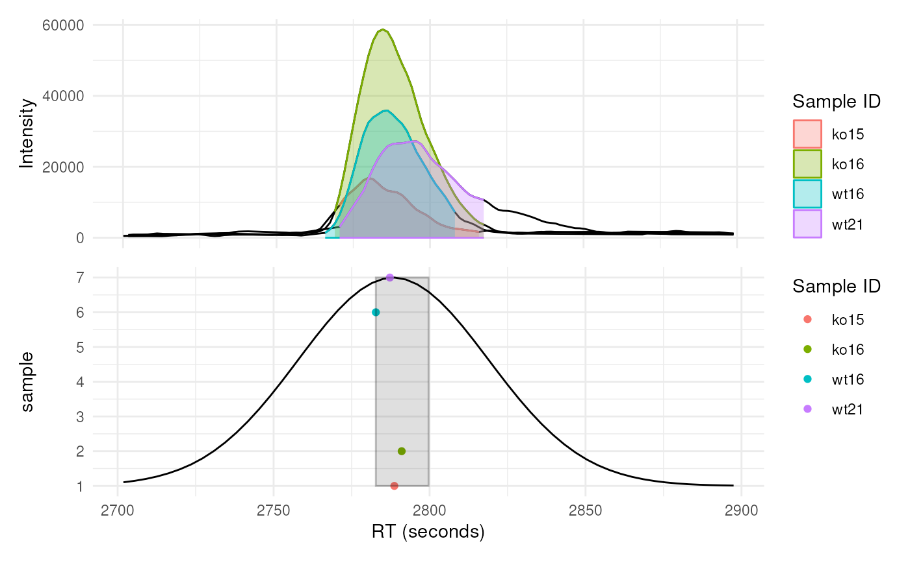

## Plot spectra

Spectra are added to a plot with the
[`lp_spectra()`](https://rdrr.io/pkg/lcmsPlot/man/lp_spectra.html)
function. Its `mode` parameter determines which scan a spectrum is
extracted from.

### Select the closest scan to a specified retention time

With `mode = "closest"` the spectrum is taken from the scan closest to
the retention time given by the `rt` parameter. The retention time at
which the spectrum was acquired is marked with a vertical dashed line on
the chromatogram, so that the spectrum can be related to the
chromatographic peak it belongs to.

\
[`lcmsPlot`](https://rdrr.io/pkg/lcmsPlot/man/lcmsPlot.html)`(``xdata``, sample_id_column ``=`` ``"sample_name"``)`` ``+`\
`    `[`lp_chromatogram`](https://rdrr.io/pkg/lcmsPlot/man/lp_chromatogram.html)`(`\
`        features ``=`` ``"FT034"``,`\
`        sample_ids ``=`` ``"ko15"``,`\
`        ppm ``=`` ``20``,`\
`        rt_tol ``=`` ``60``,`\
`        highlight_peaks ``=`` ``TRUE``)`` ``+`\
`    `[`lp_spectra`](https://rdrr.io/pkg/lcmsPlot/man/lp_spectra.html)`(``rt ``=`` ``2789``, mode ``=`` ``"closest"``, ms_level ``=`` ``1``)`` ``+`\
`    `[`lp_labels`](https://rdrr.io/pkg/lcmsPlot/man/lp_labels.html)`(``title ``=`` ``"Feature FT034"``, legend ``=`` ``"Sample"``)`` ``+`\
`    `[`lp_legend`](https://rdrr.io/pkg/lcmsPlot/man/lp_legend.html)`(``position ``=`` ``"bottom"``)`

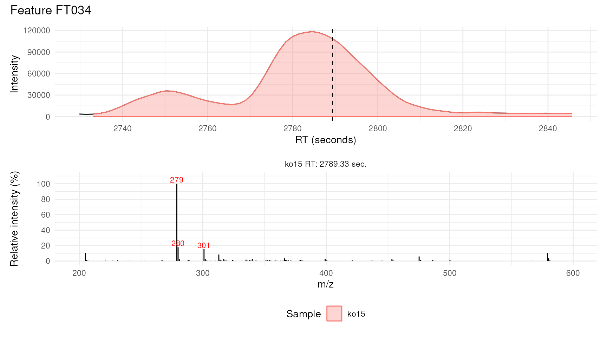

### Select the scan closest to a detected peak apex

With `mode = "closest_apex"` the retention time of the peak maximum is
determined from the chromatographic peaks detected by *xcms* and the
nearest scan is used, which removes the need to specify a retention time
manually.

In the example below, chromatograms are extracted for two features in
one sample and the MS1 spectrum at the apex of each is displayed below
its chromatogram. The
[`lp_layout()`](https://rdrr.io/pkg/lcmsPlot/man/lp_layout.html)
function is used to give the spectra more vertical space than the
chromatograms.

\
[`lcmsPlot`](https://rdrr.io/pkg/lcmsPlot/man/lcmsPlot.html)`(``xdata``, sample_id_column ``=`` ``"sample_name"``)`` ``+`\
`    `[`lp_chromatogram`](https://rdrr.io/pkg/lcmsPlot/man/lp_chromatogram.html)`(`\
`        features ``=`` `[`c`](https://rdrr.io/r/base/c.html)`(``"FT219"``, ``"FT250"``)``,`\
`        sample_ids ``=`` ``"ko15"``,`\
`        ppm ``=`` ``20``,`\
`        rt_tol ``=`` ``60``,`\
`        highlight_peaks ``=`` ``TRUE``)`` ``+`\
`    `[`lp_spectra`](https://rdrr.io/pkg/lcmsPlot/man/lp_spectra.html)`(``mode ``=`` ``"closest_apex"``, ms_level ``=`` ``1``)`` ``+`\
`    `[`lp_facets`](https://rdrr.io/pkg/lcmsPlot/man/lp_facets.html)`(``facets ``=`` ``"feature_id"``, ncol ``=`` ``2``)`` ``+`\
`    `[`lp_labels`](https://rdrr.io/pkg/lcmsPlot/man/lp_labels.html)`(``legend ``=`` ``"Sample"``)`` ``+`\
`    `[`lp_legend`](https://rdrr.io/pkg/lcmsPlot/man/lp_legend.html)`(``position ``=`` ``"bottom"``)`` ``+`\
`    `[`lp_layout`](https://rdrr.io/pkg/lcmsPlot/man/lp_layout.html)`(``design ``=`` ``"C\nS\nS"``)`

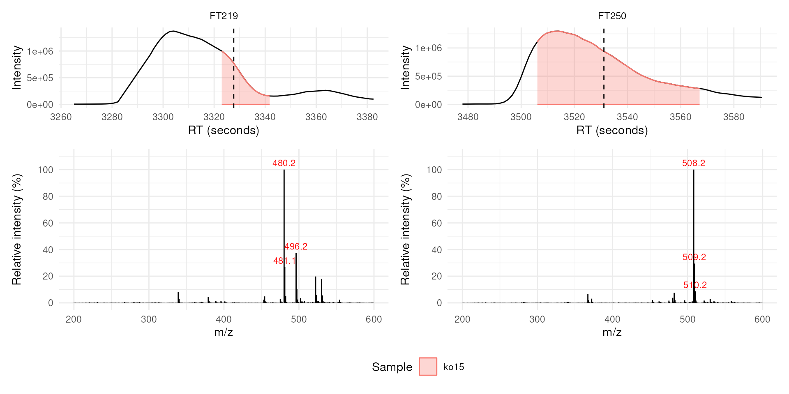

Each spectrum is dominated by the m/z of its own feature, accompanied by
the corresponding isotope peaks.

### Select multiple scans across a detected peak

To follow how the spectral composition changes over the duration of a
chromatographic peak, several scans can be extracted across it with
`mode = "across_peak"`. The `interval` parameter defines the retention
time spacing (in seconds) between the selected scans.

\
[`lcmsPlot`](https://rdrr.io/pkg/lcmsPlot/man/lcmsPlot.html)`(``xdata``, sample_id_column ``=`` ``"sample_name"``)`` ``+`\
`    `[`lp_chromatogram`](https://rdrr.io/pkg/lcmsPlot/man/lp_chromatogram.html)`(`\
`        features ``=`` ``"FT083"``,`\
`        sample_ids ``=`` ``"ko15"``,`\
`        ppm ``=`` ``20``,`\
`        rt_tol ``=`` ``60``,`\
`        highlight_peaks ``=`` ``TRUE``)`` ``+`\
`    `[`lp_spectra`](https://rdrr.io/pkg/lcmsPlot/man/lp_spectra.html)`(``mode ``=`` ``"across_peak"``, interval ``=`` ``15``, ms_level ``=`` ``1``)`` ``+`\
`    `[`lp_labels`](https://rdrr.io/pkg/lcmsPlot/man/lp_labels.html)`(``legend ``=`` ``"Sample"``)`` ``+`\
`    `[`lp_legend`](https://rdrr.io/pkg/lcmsPlot/man/lp_legend.html)`(``position ``=`` ``"bottom"``)`` ``+`\
`    `[`lp_layout`](https://rdrr.io/pkg/lcmsPlot/man/lp_layout.html)`(``design ``=`` ``"C\nS\nS"``)`

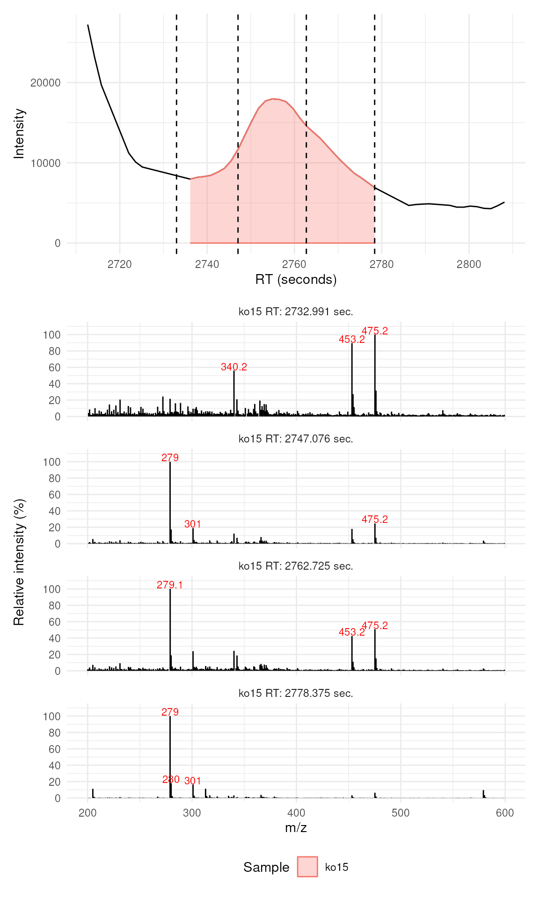

This view makes co-elution visible: the ion of the feature dominates the
spectrum at the beginning of the peak, while towards its end other ions
become the most intense signals of the scan.

### Plot standalone spectra

Spectra can also be plotted on their own, without an accompanying
chromatogram, which is useful for a detailed comparison of isotope
patterns or relative ion intensities between samples. Standalone spectra
are created by using
[`lp_spectra()`](https://rdrr.io/pkg/lcmsPlot/man/lp_spectra.html)
without
[`lp_chromatogram()`](https://rdrr.io/pkg/lcmsPlot/man/lp_chromatogram.html).

\
[`lcmsPlot`](https://rdrr.io/pkg/lcmsPlot/man/lcmsPlot.html)`(``xdata``, sample_id_column ``=`` ``"sample_name"``)`` ``+`\
`    `[`lp_spectra`](https://rdrr.io/pkg/lcmsPlot/man/lp_spectra.html)`(`\
`        sample_ids ``=`` `[`c`](https://rdrr.io/r/base/c.html)`(``"ko15"``, ``"wt15"``)``,`\
`        rt ``=`` ``3323``,`\
`        mode ``=`` ``"closest"``,`\
`        ms_level ``=`` ``1``)`` ``+`\
`    `[`lp_labels`](https://rdrr.io/pkg/lcmsPlot/man/lp_labels.html)`(``title ``=`` ``"MS1 spectra at 3323 seconds"``)`` ``+`\
`    `[`lp_legend`](https://rdrr.io/pkg/lcmsPlot/man/lp_legend.html)`(``position ``=`` ``"bottom"``)`

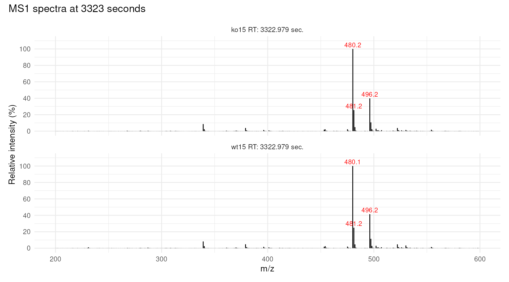

## Session information

\
[`sessionInfo`](https://rdrr.io/r/utils/sessionInfo.html)`(``)`

    ## R version 4.6.1 (2026-06-24)
    ## Platform: x86_64-pc-linux-gnu
    ## Running under: Ubuntu 24.04.4 LTS
    ## 
    ## Matrix products: default
    ## BLAS:   /usr/lib/x86_64-linux-gnu/openblas-pthread/libblas.so.3 
    ## LAPACK: /usr/lib/x86_64-linux-gnu/openblas-pthread/libopenblasp-r0.3.26.so;  LAPACK version 3.12.0
    ## 
    ## locale:
    ##  [1] LC_CTYPE=en_US.UTF-8       LC_NUMERIC=C              
    ##  [3] LC_TIME=en_US.UTF-8        LC_COLLATE=en_US.UTF-8    
    ##  [5] LC_MONETARY=en_US.UTF-8    LC_MESSAGES=en_US.UTF-8   
    ##  [7] LC_PAPER=en_US.UTF-8       LC_NAME=C                 
    ##  [9] LC_ADDRESS=C               LC_TELEPHONE=C            
    ## [11] LC_MEASUREMENT=en_US.UTF-8 LC_IDENTIFICATION=C       
    ## 
    ## time zone: UTC
    ## tzcode source: system (glibc)
    ## 
    ## attached base packages:
    ## [1] stats4    stats     graphics  grDevices utils     datasets  methods  
    ## [8] base     
    ## 
    ## other attached packages:
    ##  [1] MSnbase_2.39.5       S4Vectors_0.51.10    Biobase_2.73.2      
    ##  [4] BiocGenerics_0.59.12 generics_0.1.4       mzR_2.47.1          
    ##  [7] Rcpp_1.1.2           lcmsPlot_1.1.13      xcms_4.11.4         
    ## [10] BiocParallel_1.47.0  BiocStyle_2.41.0    
    ## 
    ## loaded via a namespace (and not attached):
    ##   [1] DBI_1.3.0                   rlang_1.3.0                
    ##   [3] magrittr_2.0.5              clue_0.3-68                
    ##   [5] MassSpecWavelet_1.79.2      otel_0.2.0                 
    ##   [7] matrixStats_1.5.0           compiler_4.6.1             
    ##   [9] PTMods_1.1.0                systemfonts_1.3.2          
    ##  [11] vctrs_0.7.3                 reshape2_1.4.5             
    ##  [13] stringr_1.6.0               ProtGenerics_1.45.0        
    ##  [15] crayon_1.5.3                pkgconfig_2.0.3            
    ##  [17] MetaboCoreUtils_1.21.1      fastmap_1.2.0              
    ##  [19] XVector_0.53.0              labeling_0.4.3             
    ##  [21] rmarkdown_2.32              preprocessCore_1.75.1      
    ##  [23] ragg_1.5.2                  purrr_1.2.2                
    ##  [25] xfun_0.61                   MultiAssayExperiment_1.39.1
    ##  [27] cachem_1.1.0                jsonlite_2.0.0             
    ##  [29] progress_1.2.3              DelayedArray_0.39.8        
    ##  [31] prettyunits_1.2.0           parallel_4.6.1             
    ##  [33] cluster_2.1.8.3             R6_2.6.1                   
    ##  [35] bslib_0.12.0                stringi_1.8.9              
    ##  [37] RColorBrewer_1.1-3          limma_3.99.0               
    ##  [39] GenomicRanges_1.65.4        jquerylib_0.1.4            
    ##  [41] iterators_1.0.14            Seqinfo_1.3.2              
    ##  [43] bookdown_0.48               SummarizedExperiment_1.43.0
    ##  [45] knitr_1.52                  IRanges_2.47.5             
    ##  [47] Matrix_1.7-6                igraph_2.3.4               
    ##  [49] tidyselect_1.2.1            abind_1.4-8                
    ##  [51] yaml_2.3.12                 doParallel_1.0.17          
    ##  [53] codetools_0.2-20            affy_1.91.0                
    ##  [55] lattice_0.23-1              tibble_3.3.1               
    ##  [57] plyr_1.8.9                  withr_3.0.3                
    ##  [59] S7_0.2.2                    evaluate_1.0.5             
    ##  [61] desc_1.4.3                  Spectra_1.23.5             
    ##  [63] pillar_1.11.1               affyio_1.83.0              
    ##  [65] BiocManager_1.30.27         MatrixGenerics_1.25.0      
    ##  [67] foreach_1.5.2               MALDIquant_1.22.3          
    ##  [69] ncdf4_1.24                  hms_1.1.4                  
    ##  [71] ggplot2_4.0.3               scales_1.4.0               
    ##  [73] MsExperiment_1.15.0         glue_1.8.1                 
    ##  [75] MsFeatures_1.21.0           lazyeval_0.2.3             
    ##  [77] tools_4.6.1                 mzID_1.51.0                
    ##  [79] data.table_1.18.6.1         QFeatures_1.23.2           
    ##  [81] vsn_3.81.1                  fs_2.1.0                   
    ##  [83] XML_3.99-0.25               grid_4.6.1                 
    ##  [85] impute_1.87.0               tidyr_1.3.2                
    ##  [87] MsCoreUtils_1.25.4          patchwork_1.3.2            
    ##  [89] PSMatch_1.17.0              cli_3.6.6                  
    ##  [91] textshaping_1.0.5           viridisLite_0.4.3          
    ##  [93] S4Arrays_1.13.2             Chromatograms_1.3.3        
    ##  [95] dplyr_1.2.1                 AnnotationFilter_1.37.0    
    ##  [97] pcaMethods_2.5.0            gtable_0.3.6               
    ##  [99] sass_0.4.10                 digest_0.6.39              
    ## [101] SparseArray_1.13.4          htmlwidgets_1.6.4          
    ## [103] farver_2.1.2                htmltools_0.5.9            
    ## [105] pkgdown_2.2.1.9000          lifecycle_1.0.5            
    ## [107] statmod_1.5.2               MASS_7.3-66

1\. Saghatelian A, Trauger SA, Want EJ, Hawkins EG, Siuzdak G, Cravatt
BF: **[Assignment of endogenous substrates to enzymes by global
metabolite profiling](http://dx.doi.org/10.1021/bi0480335)**.
*Biochemistry* 2004, **43**:14332–9.
