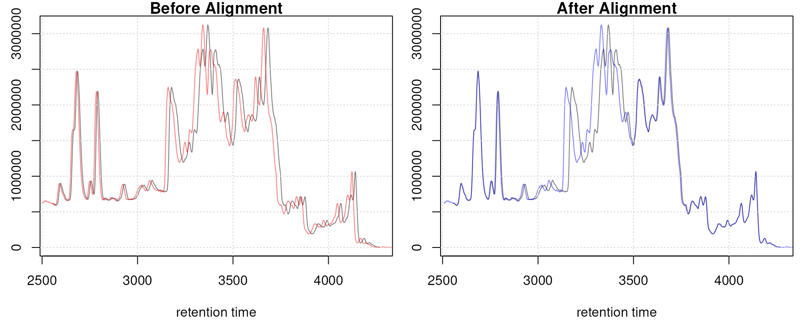
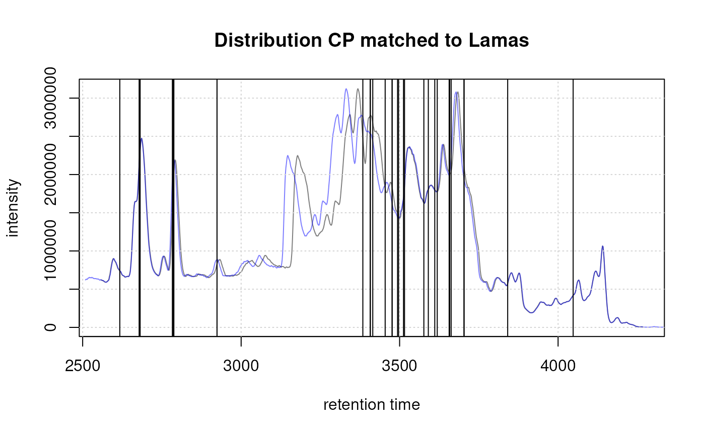
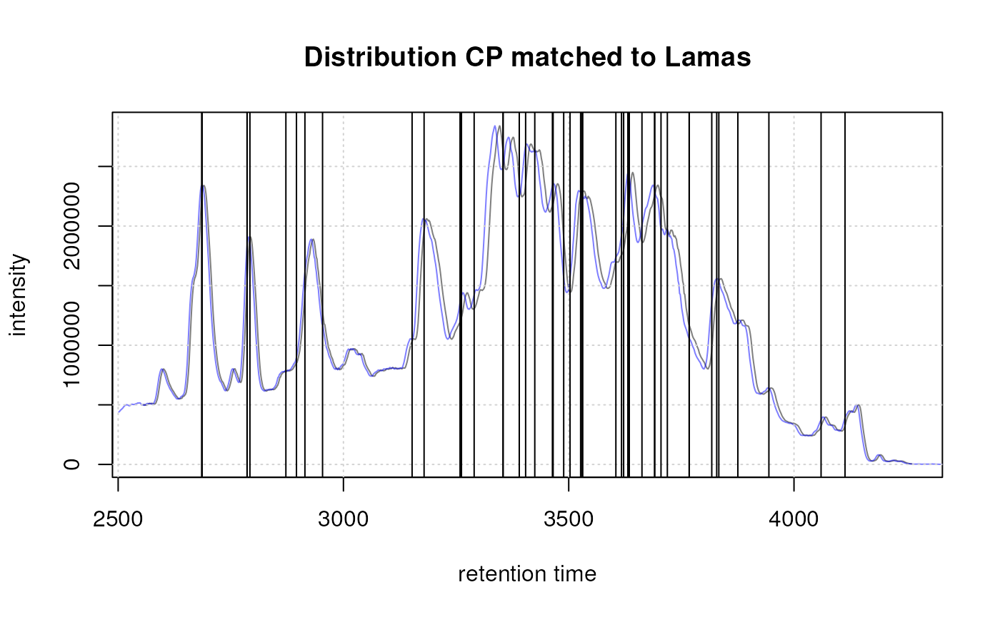

# LC-MS data preprocessing and analysis with xcms

**Package**: *[xcms](https://bioconductor.org/packages/3.23/xcms)*\
**Authors**: Philippine Louail, Johannes Rainer\
**Modified**: 2026-04-22 09:50:36.294717\
**Compiled**: Wed Apr 22 11:07:08 2026

## Introduction

The *[xcms](https://bioconductor.org/packages/3.23/xcms)* package
provides the functionality to perform the preprocessing of LC-MS, GC-MS
or LC-MS/MS data in which raw signals from mzML, mzXML or CDF files are
processed into *feature* abundances. This preprocessing includes
chromatographic peak detection, sample alignment and correspondence
analysis.

The first version of the package was already published in 2006 \[1\] and
has since been updated and modernized in several rounds to better
integrate it with other R-based packages for the analysis of untargeted
metabolomics data. This includes version 3 of *xcms* that used the
*[MSnbase](https://bioconductor.org/packages/3.23/MSnbase)* package for
MS data representation \[2\]. The most recent update (*xcms* version 4)
\[3\] enables in addition preprocessing of MS data represented by the
modern
*[MsExperiment](https://bioconductor.org/packages/3.23/MsExperiment)*
and *[Spectra](https://bioconductor.org/packages/3.23/Spectra)* packages
which provides an even better integration with the
[RforMassSpectrometry](https://rformassspectrometry.org) R package
ecosystem simplifying e.g. also compound annotation \[4\].

This document describes data import, exploration and preprocessing of a
simple test LC-MS data set with the *xcms* package version \>= 4 \[3\].
The same functions can be applied to the older *MSnbase*-based workflows
(xcms version 3). Additional documents and tutorials covering also other
topics of untargeted metabolomics analysis are listed at the end of this
document. An extensive collection of metabolomics data analysis
tutorials, also including a complete end-to-end data analysis workflow
as well as an example analysis of a very large-scale experiment using
the new *on-disk* *xcms* result object is available at the [Metabonaut
website](https://rformassspectrometry.github.io/Metabonaut/).

## Preprocessing of LC-MS data

### Data import

*xcms* supports analysis of any LC-MS(/MS) data that can be imported
with the *[Spectra](https://bioconductor.org/packages/3.23/Spectra)*
package. Such data will typically be provided in (AIA/ANDI) NetCDF,
mzXML and mzML format but can, through dedicated extensions to the
*Spectra* package, also be imported from other sources, e.g. also
directly from raw data files in manufacturer’s formats.

For demonstration purpose we will analyze in this document a small
subset of the data from \[5\] in which the metabolic consequences of the
knock-out of the fatty acid amide hydrolase (FAAH) gene in mice was
investigated. The raw data files (in NetCDF format) are provided through
the *[faahKO](https://bioconductor.org/packages/3.23/faahKO)* data
package. The data set consists of samples from the spinal cords of 6
knock-out and 6 wild-type mice. Each file contains data in centroid mode
acquired in positive ion polarity from 200-600 m/z and 2500-4500
seconds. To speed-up processing of this vignette we will restrict the
analysis to only 8 files.

Below we load all required packages, locate the raw CDF files within the
*faahKO* package and build a *phenodata* `data.frame` describing the
experimental setup. Generally, such data frames should contain all
relevant experimental variables and sample descriptions (including also
the names of the raw data files) and will be imported into R using
either the [`read.table()`](https://rdrr.io/r/utils/read.table.html)
function (if the file is in *csv* or tabulator delimited text file
format) or also using functions from the *readxl* R package if it is in
Excel file format.

``` r

library(xcms)
library(faahKO)
library(RColorBrewer)
library(pander)
library(pheatmap)
library(MsExperiment)

## Get the full path to the CDF files
cdfs <- dir(system.file("cdf", package = "faahKO"), full.names = TRUE,
            recursive = TRUE)[c(1, 2, 5, 6, 7, 8, 11, 12)]
## Create a phenodata data.frame
pd <- data.frame(sample_name = sub(basename(cdfs), pattern = ".CDF",
                                   replacement = "", fixed = TRUE),
                 sample_group = c(rep("KO", 4), rep("WT", 4)),
                 stringsAsFactors = FALSE)
```

We next load our data using the `readMsExperiment` function from the
*[MsExperiment](https://bioconductor.org/packages/3.23/MsExperiment)*
package.

``` r

faahko <- readMsExperiment(spectraFiles = cdfs, sampleData = pd)
faahko
```

    ## Object of class MsExperiment 
    ##  Spectra: MS1 (10224) 
    ##  Experiment data: 8 sample(s)
    ##  Sample data links:
    ##   - spectra: 8 sample(s) to 10224 element(s).

The MS spectra data from our experiment is now available as a `Spectra`
object within `faahko`. Note that this `MsExperiment` container could in
addition to spectra data also contain other types of data or also
references to other files. See the vignette from the
*[MsExperiment](https://bioconductor.org/packages/3.23/MsExperiment)*
for more details. Also, when loading data from mzML, mzXML or CDF files,
by default only general spectra data is loaded into memory while the
actual *peaks data*, i.e. the m/z and intensity values are only
retrieved on-the-fly from the raw files when needed (this is similar to
the *MSnbase* *on-disk* mode described in \[2\]). This guarantees a low
memory footprint hence allowing to analyze also large experiments
without the need of high performance computing environments. Note that
also different alternative *backends* (and hence data representations)
could be used for the `Spectra` object within `faahko` with eventually
even lower memory footprint, or higher performance. See the package
vignette from the
*[Spectra](https://bioconductor.org/packages/3.23/Spectra)* package or
the [SpectraTutorials](https://jorainer.github.io/SpectraTutorials)
tutorial for more details on `Spectra` backends and how to change
between them.

### Initial data inspection

The `MsExperiment` object is a simple and flexible container for MS
experiments. The *raw* MS data is stored as a `Spectra` object that can
be accessed through the
[`spectra()`](https://rdrr.io/pkg/ProtGenerics/man/protgenerics.html)
function.

``` r

spectra(faahko)
```

    ## MSn data (Spectra) with 10224 spectra in a MsBackendMzR backend:
    ##         msLevel     rtime scanIndex
    ##       <integer> <numeric> <integer>
    ## 1             1   2501.38         1
    ## 2             1   2502.94         2
    ## 3             1   2504.51         3
    ## 4             1   2506.07         4
    ## 5             1   2507.64         5
    ## ...         ...       ...       ...
    ## 10220         1   4493.56      1274
    ## 10221         1   4495.13      1275
    ## 10222         1   4496.69      1276
    ## 10223         1   4498.26      1277
    ## 10224         1   4499.82      1278
    ##  ... 34 more variables/columns.
    ## 
    ## file(s):
    ## ko15.CDF
    ## ko16.CDF
    ## ko21.CDF
    ##  ... 5 more files

All spectra are organized *sequentially* (i.e., not by file) but the
[`fromFile()`](https://lgatto.github.io/MSnbase/reference/Spectrum-class.html)
function can be used to get for each spectrum the information to which
of the data files it belongs. Below we simply count the number of
spectra per file.

``` r

table(fromFile(faahko))
```

    ## 
    ##    1    2    3    4    5    6    7    8 
    ## 1278 1278 1278 1278 1278 1278 1278 1278

Information on samples can be retrieved through the
[`sampleData()`](https://rdrr.io/pkg/MsExperiment/man/MsExperiment.html)
function.

``` r

sampleData(faahko)
```

    ## DataFrame with 8 rows and 3 columns
    ##          sample_name sample_group spectraOrigin
    ##          <character>  <character>   <character>
    ## ko15.CDF        ko15           KO /__w/_temp...
    ## ko16.CDF        ko16           KO /__w/_temp...
    ## ko21.CDF        ko21           KO /__w/_temp...
    ## ko22.CDF        ko22           KO /__w/_temp...
    ## wt15.CDF        wt15           WT /__w/_temp...
    ## wt16.CDF        wt16           WT /__w/_temp...
    ## wt21.CDF        wt21           WT /__w/_temp...
    ## wt22.CDF        wt22           WT /__w/_temp...

Each row in this `DataFrame` represents one sample (input file). Using
`[` it is possible to subset a `MsExperiment` object **by sample**.
Below we subset the `faahko` to the 3rd sample (file) and access its
spectra and sample data.

``` r

faahko_3 <- faahko[3]
spectra(faahko_3)
```

    ## MSn data (Spectra) with 1278 spectra in a MsBackendMzR backend:
    ##        msLevel     rtime scanIndex
    ##      <integer> <numeric> <integer>
    ## 1            1   2501.38         1
    ## 2            1   2502.94         2
    ## 3            1   2504.51         3
    ## 4            1   2506.07         4
    ## 5            1   2507.64         5
    ## ...        ...       ...       ...
    ## 1274         1   4493.56      1274
    ## 1275         1   4495.13      1275
    ## 1276         1   4496.69      1276
    ## 1277         1   4498.26      1277
    ## 1278         1   4499.82      1278
    ##  ... 34 more variables/columns.
    ## 
    ## file(s):
    ## ko21.CDF

``` r

sampleData(faahko_3)
```

    ## DataFrame with 1 row and 3 columns
    ##          sample_name sample_group spectraOrigin
    ##          <character>  <character>   <character>
    ## ko21.CDF        ko21           KO /__w/_temp...

As a first evaluation of the data we below plot the base peak
chromatogram (BPC) for each file in our experiment. We use the
[`chromatogram()`](https://sneumann.github.io/xcms/reference/chromatogram-method.md)
method and set the `aggregationFun` to `"max"` to return for each
spectrum the maximal intensity and hence create the BPC from the raw
data. To create a total ion chromatogram we could set `aggregationFun`
to `"sum"`.

``` r

## Get the base peak chromatograms. This reads data from the files.
bpis <- chromatogram(faahko, aggregationFun = "max")
## Define colors for the two groups
group_colors <- paste0(brewer.pal(3, "Set1")[1:2], "60")
names(group_colors) <- c("KO", "WT")

## Plot all chromatograms.
plot(bpis, col = group_colors[sampleData(faahko)$sample_group])
```


Base peak chromatogram.

The
[`chromatogram()`](https://sneumann.github.io/xcms/reference/chromatogram-method.md)
method returned a `MChromatograms` object that organizes individual
`Chromatogram` objects (which in fact contain the chromatographic data)
in a two-dimensional array: columns represent samples and rows
(optionally) m/z and/or retention time ranges. Below we extract the
chromatogram of the first sample and access its retention time and
intensity values.

``` r

bpi_1 <- bpis[1, 1]
rtime(bpi_1) |> head()
```

    ## [1] 2501.378 2502.943 2504.508 2506.073 2507.638 2509.203

``` r

intensity(bpi_1) |> head()
```

    ## [1] 43888 43960 43392 42632 42200 42288

From the BPC above it seems that after around 4200 seconds no signal is
measured anymore. Thus, we filter below the full data set to a retention
time range from 2550 to 4250 seconds using the
[`filterRt()`](https://rdrr.io/pkg/ProtGenerics/man/protgenerics.html)
function. Note that at present this will only subset the spectra within
the `MsExperiment`. Subsequently we re-create also the BPC.

``` r

faahko <- filterRt(faahko, rt = c(2550, 4250))
## creating the BPC on the subsetted data
bpis <- chromatogram(faahko, aggregationFun = "max")
```

We next create boxplots representing the distribution of the total ion
currents per data file. Such plots can be very useful to spot
potentially problematic MS runs. To extract this information, we use the
[`tic()`](https://rdrr.io/pkg/ProtGenerics/man/protgenerics.html)
function on the `Spectra` object within `faahko` and split the values by
file using
[`fromFile()`](https://lgatto.github.io/MSnbase/reference/Spectrum-class.html).

``` r

## Get the total ion current by file
tc <- spectra(faahko) |>
    tic() |>
    split(f = fromFile(faahko))
boxplot(tc, col = group_colors[sampleData(faahko)$sample_group],
        ylab = "intensity", main = "Total ion current")
```


Distribution of total ion currents per file.

In addition, we can also cluster the samples based on similarity of
their base peak chromatograms. Samples would thus be grouped based on
similarity of their LC runs. For that we need however to *bin* the data
along the retention time axis, since retention times will generally
differ between samples. Below we use the
[`bin()`](https://rdrr.io/pkg/ProtGenerics/man/protgenerics.html)
function on the BPC to bin intensities into 2 second wide retention time
bins. The clustering is then performed using complete linkage
hierarchical clustering on the pairwise correlations of the binned base
peak chromatograms.

``` r

## Bin the BPC
bpis_bin <- bin(bpis, binSize = 2)

## Calculate correlation on the log2 transformed base peak intensities
cormat <- cor(log2(do.call(cbind, lapply(bpis_bin, intensity))))
colnames(cormat) <- rownames(cormat) <- bpis_bin$sample_name

## Define which phenodata columns should be highlighted in the plot
ann <- data.frame(group = bpis_bin$sample_group)
rownames(ann) <- bpis_bin$sample_name

## Perform the cluster analysis
pheatmap(cormat, annotation = ann,
         annotation_color = list(group = group_colors))
```


Grouping of samples based on similarity of their base peak chromatogram.

The samples cluster in a pairwise manner, with the KO and WT samples for
the same sample index having the most similar BPC.

### Chromatographic peak detection

Chromatographic peak detection aims at identifying all signal in each
sample created from ions of the same originating compound species.
Chromatographic peak detection can be performed in *xcms* with the
[`findChromPeaks()`](https://sneumann.github.io/xcms/reference/findChromPeaks.md)
function and a *parameter* object which defines and configures the
algorithm that should be used (see
[`?findChromPeaks`](https://sneumann.github.io/xcms/reference/findChromPeaks.md)
for a list of supported algorithms). Before running any peak detection
it is however strongly suggested to first visually inspect the extracted
ion chromatogram of e.g. internal standards or compounds known to be
present in the samples in order to evaluate and adapt the settings of
the peak detection algorithm since the default settings will not be
appropriate for most LC-MS setups.

Below we extract the EIC for one compound using the
[`chromatogram()`](https://sneumann.github.io/xcms/reference/chromatogram-method.md)
function by specifying in addition the m/z and retention time range
where we would expect the signal for that compound.

``` r

## Define the rt and m/z range of the peak area
rtr <- c(2700, 2900)
mzr <- c(334.9, 335.1)
## extract the chromatogram
chr_raw <- chromatogram(faahko, mz = mzr, rt = rtr)
plot(chr_raw, col = group_colors[chr_raw$sample_group])
```


Extracted ion chromatogram for one peak.

Note that `Chromatogram` objects extracted by the
[`chromatogram()`](https://sneumann.github.io/xcms/reference/chromatogram-method.md)
method contain an `NA` value if in a certain scan (i.e. in a spectrum
for a specific retention time) no signal was measured in the respective
m/z range. This is reflected by the lines not being drawn as continuous
lines in the plot above.

The peak above has thus a width of about 50 seconds. We can use this
information to define the `peakwidth` parameter of the *centWave* peak
detection method \[6\] that we will use for chromatographic peak
detection on our data. The `peakwidth` parameter allows to define the
expected lower and upper width (in retention time dimension) of
chromatographic peaks. For our data we set it thus to
`peakwidth = c(20, 80)`. The second important parameter for *centWave*
is `ppm` which defines the expected maximum deviation of m/z values of
the centroids that should be included into one chromatographic peak
(note that this is **not** the precision of m/z values provided by the
MS instrument manufacturer).

For the `ppm` parameter we extract the full MS data (intensity,
retention time and m/z values) corresponding to the above peak. To this
end we first filter the raw object by retention time, then by m/z and
finally plot the object with `type = "XIC"` to produce the plot below.
We use the *pipe* (`|>`) operator to better illustrate the corresponding
workflow.

``` r

faahko |>
filterRt(rt = rtr) |>
filterMz(mz = mzr) |>
plot(type = "XIC")
```


Visualization of the raw MS data for one peak. For each plot: upper
panel: chromatogram plotting the intensity values against the retention
time, lower panel m/z against retention time plot. The individual data
points are colored according to the intensity.

In the present data there is actually no variation in the m/z values.
Usually the m/z values of the individual centroids (lower panel) in the
plots above would scatter around the *real* m/z value of the compound
(in an intensity dependent manner).

The first step of the *centWave* algorithm defines *regions of interest*
(ROI) that are subsequently screened for the presence of chromatographic
peaks. These ROIs are defined based on the difference of m/z values of
centroids from consecutive scans (spectra). In detail, centroids from
consecutive scans are included into a ROI if the difference between
their m/z and the mean m/z of the ROI is smaller than the user defined
`ppm` parameter. A reasonable choice for the `ppm` could thus be the
maximal m/z difference of data points from neighboring scans/spectra
that are part of a chromatographic peak for an internal standard of
known compound. It is suggested to inspect the ranges of m/z values for
several compounds (either internal standards or compounds known to be
present in the sample) and define the `ppm` parameter for *centWave*
according to these. See also this
[tutorial](https://jorainer.github.io/xcmsTutorials) for additional
information and examples on choosing and testing peak detection
settings.

Chromatographic peak detection can also be performed on extracted ion
chromatograms, which helps testing and tuning peak detection settings.
Note however that peak detection on EICs does not involve the first step
of *centWave* described above and will thus **not** consider the `ppm`
parameter. Also, since less data is available to the algorithms,
background signal estimation is performed differently and different
settings for `snthresh` will need to be used (generally a lower
`snthresh` will be used for EICs since the estimated background signal
tends to be higher for data subsets than for the full data). Below we
perform the peak detection with the
[`findChromPeaks()`](https://sneumann.github.io/xcms/reference/findChromPeaks.md)
function on the EIC generated above. The submitted *parameter* object
defines which algorithm will be used and allows to define the settings
for this algorithm. We use a `CentWaveParam` parameter object to use and
configure the *centWave* algorithm with default settings, except for
`snthresh`.

``` r

xchr <- findChromPeaks(chr_raw, param = CentWaveParam(snthresh = 2))
```

We can access the identified chromatographic peaks with the
[`chromPeaks()`](https://sneumann.github.io/xcms/reference/XCMSnExp-class.md)
function.

``` r

chromPeaks(xchr)
```

    ##        mz mzmin mzmax       rt    rtmin    rtmax        into        intb  maxo
    ## mzmin 335 334.9 335.1 2781.505 2761.160 2809.674  412134.255  355516.374 16856
    ## mzmin 335 334.9 335.1 2786.199 2764.290 2812.803 1496244.206 1391821.332 58736
    ## mzmin 335 334.9 335.1 2734.556 2714.211 2765.855   21579.367   18449.428   899
    ## mzmin 335 334.9 335.1 2797.154 2775.245 2815.933  159058.782  150289.314  6295
    ## mzmin 335 334.9 335.1 2784.635 2761.160 2808.109   54947.545   37923.532  2715
    ## mzmin 335 334.9 335.1 2859.752 2845.668 2878.532   13895.212   13874.868   905
    ## mzmin 335 334.9 335.1 2897.311 2891.051 2898.876    5457.155    5450.895   995
    ## mzmin 335 334.9 335.1 2819.064 2808.109 2834.713   19456.914   19438.134  1347
    ## mzmin 335 334.9 335.1 2789.329 2762.725 2808.109  174473.311   91114.975  8325
    ## mzmin 335 334.9 335.1 2786.199 2764.290 2812.803  932645.211  569236.246 35856
    ## mzmin 335 334.9 335.1 2792.461 2768.987 2823.760  876585.527  511324.134 27200
    ## mzmin 335 334.9 335.1 2789.329 2773.680 2806.544   89582.569   73871.386  5427
    ##         sn row column
    ## mzmin   13   1      1
    ## mzmin   20   1      2
    ## mzmin    4   1      3
    ## mzmin   12   1      3
    ## mzmin    2   1      4
    ## mzmin  904   1      4
    ## mzmin  994   1      4
    ## mzmin 1576   1      4
    ## mzmin    3   1      5
    ## mzmin    2   1      6
    ## mzmin    2   1      7
    ## mzmin    6   1      8

Parallel to the
[`chromPeaks()`](https://sneumann.github.io/xcms/reference/XCMSnExp-class.md)
matrix there is also a
[`chromPeakData()`](https://sneumann.github.io/xcms/reference/XCMSnExp-class.md)
data frame that allows to add arbitrary annotations to each
chromatographic peak, such as e.g. the MS level in which the peak was
detected:

``` r

chromPeakData(xchr)
```

    ## DataFrame with 12 rows and 4 columns
    ##        ms_level is_filled       row    column
    ##       <integer> <logical> <integer> <integer>
    ## mzmin         1     FALSE         1         1
    ## mzmin         1     FALSE         1         2
    ## mzmin         1     FALSE         1         3
    ## mzmin         1     FALSE         1         3
    ## mzmin         1     FALSE         1         4
    ## ...         ...       ...       ...       ...
    ## mzmin         1     FALSE         1         4
    ## mzmin         1     FALSE         1         5
    ## mzmin         1     FALSE         1         6
    ## mzmin         1     FALSE         1         7
    ## mzmin         1     FALSE         1         8

Below we plot the EIC along with all identified chromatographic peaks
using the [`plot()`](https://rdrr.io/r/base/plot.html) function on the
result object from above. Additional parameters `peakCol` and `peakBg`
allow to define a foreground and background (fill) color for each
identified chromatographic peak in the provided result object (i.e., we
need to define one color for each row of `chromPeaks(xchr)` - column
`"column"` (or `"sample"` if present) in that peak matrix specifies the
sample in which the peak was identified).

``` r

## Define a color for each sample
sample_colors <- group_colors[xchr$sample_group]
## Define the background color for each chromatographic peak
bg <- sample_colors[chromPeaks(xchr)[, "column"]]
## Parameter `col` defines the color of each sample/line, `peakBg` of each
## chromatographic peak.
plot(xchr, col = sample_colors, peakBg = bg)
```


Signal for an example peak. Red and blue colors represent KO and wild
type samples, respectively. Peak area of identified chromatographic
peaks are highlighted in the sample group color.

If we are happy with the settings we can use them for the peak detection
on the full data set (i.e. on the `MsExperiment` object with the data
for the whole experiment). Note that below we set the argument
`prefilter` to `c(6, 5000)` and `noise` to `5000` to reduce the run time
of this vignette. With this setting we consider only ROIs with at least
6 centroids with an intensity larger than 5000 for the *centWave*
chromatographic peak detection.

``` r

cwp <- CentWaveParam(peakwidth = c(20, 80), noise = 5000,
                     prefilter = c(6, 5000))
faahko <- findChromPeaks(faahko, param = cwp)
```

The results of
[`findChromPeaks()`](https://sneumann.github.io/xcms/reference/findChromPeaks.md)
on a `MsExperiment` object are returned as an `XcmsExperiment` object.
This object extends `MsExperiment` directly (hence providing the same
access to all raw data) and contains all *xcms* preprocessing results.
Note also that additional rounds of chromatographic peak detections
could be performed and their results being added to existing peak
detection results by additional calls to
[`findChromPeaks()`](https://sneumann.github.io/xcms/reference/findChromPeaks.md)
on the result object and using parameter `add = TRUE`.

The `chromPeaks` function can also here be used to access the results
from the chromatographic peak detection. Below we show the first 6
identified chromatographic peaks.

``` r

chromPeaks(faahko) |>
    head()
```

    ##           mz mzmin mzmax       rt    rtmin    rtmax     into     intb  maxo sn
    ## CP0001 594.0 594.0 594.0 2601.535 2581.191 2637.529 161042.2 146073.3  7850 11
    ## CP0002 577.0 577.0 577.0 2604.665 2581.191 2626.574 136105.2 128067.9  6215 11
    ## CP0003 307.0 307.0 307.0 2618.750 2592.145 2645.354 284782.4 264907.0 16872 20
    ## CP0004 302.0 302.0 302.0 2617.185 2595.275 2640.659 687146.6 669778.1 30552 43
    ## CP0005 370.1 370.1 370.1 2673.523 2643.789 2700.127 449284.6 417225.3 25672 17
    ## CP0006 427.0 427.0 427.0 2675.088 2643.789 2684.478 283334.7 263943.2 11025 13
    ##        sample
    ## CP0001      1
    ## CP0002      1
    ## CP0003      1
    ## CP0004      1
    ## CP0005      1
    ## CP0006      1

Columns of this
[`chromPeaks()`](https://sneumann.github.io/xcms/reference/XCMSnExp-class.md)
matrix might differ depending on the used peak detection algorithm.
Columns that all algorithms have to provide are: `"mz"`, `"mzmin"`,
`"mzmax"`, `"rt"`, `"rtmin"` and `"rtmax"` that define the m/z and
retention time range of the chromatographic peak (i.e. all mass peaks
within that area are used to integrate the peak signal) as well as the
m/z and retention time of the peak apex. Other mandatory columns are
`"into"` and `"maxo"` with the absolute integrated peak signal and the
maximum peak intensity. Finally, `"sample"` provides the index of the
sample in which the peak was identified.

Additional annotations for each individual peak can be extracted with
the
[`chromPeakData()`](https://sneumann.github.io/xcms/reference/XCMSnExp-class.md)
function. This data frame could also be used to add/store arbitrary
annotations for each detected peak (that don’t necessarily need to be
numeric).

``` r

chromPeakData(faahko)
```

    ## DataFrame with 2908 rows and 2 columns
    ##         ms_level is_filled
    ##        <integer> <logical>
    ## CP0001         1     FALSE
    ## CP0002         1     FALSE
    ## CP0003         1     FALSE
    ## CP0004         1     FALSE
    ## CP0005         1     FALSE
    ## ...          ...       ...
    ## CP2904         1     FALSE
    ## CP2905         1     FALSE
    ## CP2906         1     FALSE
    ## CP2907         1     FALSE
    ## CP2908         1     FALSE

#### Chromatographic peak quality

Based on the publication by Kumler et al. published in 2023 \[7\], new
quality metrics (*beta_cor* and *beta_snr*) were added to *xcms*.
*beta_cor* indicates how bell-shaped the chromatographic peak is and
*beta_snr* is estimating the signal-to-noise ratio using the residuals
from this fit. These metrics can be calculated during peak picking by
setting `verboseBetaColumns = TRUE` in the `CentWaveParam` object, or
they can be calculated afterwards by using the
[`chromPeakSummary()`](https://sneumann.github.io/xcms/reference/chromPeakSummary.md)
function with the `XcmsExperiment` object and the
`BetaDistributionParam` parameter object as input:

``` r

beta_metrics <- chromPeakSummary(faahko, BetaDistributionParam())
head(beta_metrics)
```

    ##         beta_cor beta_snr
    ## CP0001 0.9865868 5.349210
    ## CP0002 0.9401467 4.928835
    ## CP0003 0.9846982 5.783004
    ## CP0004 0.9883246 6.044377
    ## CP0005 0.6972246 5.293175
    ## CP0006 0.1358883 4.995241

The result returned by
[`chromPeakSummary()`](https://sneumann.github.io/xcms/reference/chromPeakSummary.md)
is thus a numeric matrix with the values for these quality estimates,
one row for each chromatographic peak. Using summary statistics, one can
explore the distribution of these metrics in the data.

``` r

summary(beta_metrics)
```

    ##     beta_cor          beta_snr    
    ##  Min.   :-0.8541   Min.   :3.921  
    ##  1st Qu.: 0.7390   1st Qu.:5.157  
    ##  Median : 0.9442   Median :5.594  
    ##  Mean   : 0.7904   Mean   :5.662  
    ##  3rd Qu.: 0.9771   3rd Qu.:6.097  
    ##  Max.   : 0.9990   Max.   :7.983  
    ##  NAs    :6         NAs    :6

Visual inspection gives a better idea of what these metrics represent in
terms of peak quality in the data at hand. This information can be used
to e.g. filter out peaks that don’t meet a chosen quality metric
threshold. In order to plot the detected peaks, their EIC can be
extracted with the function `chromPeakChromatograms`. An example of a
peak with a high *beta_cor* and for a peak with a low *beta_cor* score
is given below.

``` r

beta_metrics[c(4, 6), ]
```

    ##         beta_cor beta_snr
    ## CP0004 0.9883246 6.044377
    ## CP0006 0.1358883 4.995241

``` r

eics <- chromPeakChromatograms(
    faahko, peaks = rownames(chromPeaks(faahko))[c(4, 6)])
```

``` r

peak_1 <- eics[1]
peak_2 <- eics[2]
par(mfrow = c(1, 2))
plot(peak_1)
plot(peak_2)
```


Plots of high and low quality peaks. Left: peak CP0004 with a beta_cor =
0.98, right: peak CP0006 with a beta_cor = 0.13.

#### Refining peak detection

Peak detection will not always work perfectly for all types of peak
shapes present in the data set leading to peak detection artifacts, such
as (partially or completely) overlapping peaks or artificially split
peaks (common issues especially for *centWave*). *xcms* provides the
[`refineChromPeaks()`](https://sneumann.github.io/xcms/reference/refineChromPeaks.md)
function that can be called on peak detection results in order to
*refine* (or clean) peak detection results by either removing identified
peaks not passing a certain criteria or by merging artificially split or
partially or completely overlapping chromatographic peaks. Different
algorithms are available that can again be configured with their
respective parameter objects: `CleanPeaksParam` and
`FilterIntensityParam` allow to remove peaks with their retention time
range or intensity being below a specified threshold, respectively. With
`MergeNeighboringPeaksParam` it is possible to merge chromatographic
peaks and hence remove many of the above mentioned (*centWave*) peak
detection artifacts. See also
[`?refineChromPeaks`](https://sneumann.github.io/xcms/reference/refineChromPeaks.md)
for more information and help on the different methods.

Below we post-process the peak detection results merging peaks that
overlap in a 4 second window per file and for which the signal between
them is lower than 75% of the smaller peak’s maximal intensity. See the
[`?MergeNeighboringPeaksParam`](https://sneumann.github.io/xcms/reference/refineChromPeaks.md)
help page for a detailed description of the settings and the approach.

``` r

mpp <- MergeNeighboringPeaksParam(expandRt = 4)
faahko_pp <- refineChromPeaks(faahko, mpp)
```

    ## Warning in rbindlistWithRownames(pkd_new, use.names = TRUE, fill = TRUE):
    ## Dropping rownames: duplicated rownames present or rownames not available for
    ## all data.frames
    ## Warning in rbindlistWithRownames(pkd_new, use.names = TRUE, fill = TRUE):
    ## Dropping rownames: duplicated rownames present or rownames not available for
    ## all data.frames

    ## Warning in rbindlistWithRownames(lapply(res, `[[`, 2L), use.names = TRUE, :
    ## Dropping rownames: duplicated rownames present or rownames not available for
    ## all data.frames

    ## Warning in rbindlistWithRownames(pkd_new, use.names = TRUE, fill = TRUE):
    ## Dropping rownames: duplicated rownames present or rownames not available for
    ## all data.frames
    ## Warning in rbindlistWithRownames(pkd_new, use.names = TRUE, fill = TRUE):
    ## Dropping rownames: duplicated rownames present or rownames not available for
    ## all data.frames
    ## Warning in rbindlistWithRownames(pkd_new, use.names = TRUE, fill = TRUE):
    ## Dropping rownames: duplicated rownames present or rownames not available for
    ## all data.frames
    ## Warning in rbindlistWithRownames(pkd_new, use.names = TRUE, fill = TRUE):
    ## Dropping rownames: duplicated rownames present or rownames not available for
    ## all data.frames
    ## Warning in rbindlistWithRownames(pkd_new, use.names = TRUE, fill = TRUE):
    ## Dropping rownames: duplicated rownames present or rownames not available for
    ## all data.frames
    ## Warning in rbindlistWithRownames(pkd_new, use.names = TRUE, fill = TRUE):
    ## Dropping rownames: duplicated rownames present or rownames not available for
    ## all data.frames

    ## Warning in rbindlistWithRownames(lapply(res, `[[`, 2L)): Dropping rownames:
    ## duplicated rownames present or rownames not available for all data.frames

An example for a merged peak is given below.

``` r

mzr_1 <- 305.1 + c(-0.01, 0.01)
chr_1 <- chromatogram(faahko[1], mz = mzr_1)
chr_2 <- chromatogram(faahko_pp[1], mz = mzr_1)
par(mfrow = c(1, 2))
plot(chr_1)
plot(chr_2)
```


Result from the peak refinement step. Left: data before processing,
right: after refinement. The splitted peak was merged into one.

*centWave* thus detected originally 3 chromatographic peaks in the m/z
slice (left panel in the plot above) and peak refinement with
`MergeNeighboringPeaksParam` and the specified settings merged the first
two peaks into a single one (right panel in the figure above). Other
close peaks, with a lower intensity between them, were however not
merged (see below).

``` r

mzr_1 <- 496.2 + c(-0.01, 0.01)
chr_1 <- chromatogram(faahko[1], mz = mzr_1)
chr_2 <- chromatogram(faahko_pp[1], mz = mzr_1)
par(mfrow = c(1, 2))
plot(chr_1)
plot(chr_2)
```


Result from the peak refinement step. Left: data before processing,
right: after refinement. The peaks were not merged.

It is also possible to perform the peak refinement on extracted ion
chromatograms. This could again be used to test and fine-tune the
settings for the parameter and to avoid potential problematic behavior.
The `minProp` parameter for example has to be carefully chosen to avoid
merging of isomer peaks (like in the example above). With the default
`minProp = 0.75` only peaks are merged if the signal between the two
peaks is **higher** than 75% of the smaller peak’s maximal intensity.
Setting this value too low could eventually result in merging of isomers
as shown below.

``` r

#' Too low minProp could cause merging of isomers!
res <- refineChromPeaks(chr_1, MergeNeighboringPeaksParam(minProp = 0.05))
chromPeaks(res)
```

    ##         mz  mzmin  mzmax       rt    rtmin    rtmax     into intb    maxo  sn
    ## CPM1 496.2 496.19 496.21 3384.012 3294.809 3412.181 45940118   NA 1128960 177
    ##      sample row column
    ## CPM1      1   1      1

``` r

plot(res)
```


Thus, before running such a peak refinement evaluate that isomers
present in the data set were not wrongly merged based on the chosen
settings.

Before proceeding we next replace the `faahko` object with the results
from the peak refinement step.

``` r

faahko <- faahko_pp
```

Below we use the data from the
[`chromPeaks()`](https://sneumann.github.io/xcms/reference/XCMSnExp-class.md)
matrix to calculate per-file summaries of the peak detection results,
such as the number of peaks per file as well as the distribution of the
retention time widths.

``` r

summary_fun <- function(z)
    c(peak_count = nrow(z), rt = quantile(z[, "rtmax"] - z[, "rtmin"]))

T <- chromPeaks(faahko) |>
    split.data.frame(f = chromPeaks(faahko)[, "sample"]) |>
    lapply(FUN = summary_fun) |>
    do.call(what = rbind)
rownames(T) <- basename(fileNames(faahko))
pandoc.table(
    T,
    caption = paste0("Summary statistics on identified chromatographic",
                     " peaks. Shown are number of identified peaks per",
                     " sample and widths/duration of chromatographic ",
                     "peaks."))
```

|              | peak_count | rt.0% | rt.25% | rt.50% | rt.75% | rt.100% |
|:------------:|:----------:|:-----:|:------:|:------:|:------:|:-------:|
| **ko15.CDF** |    397     | 10.95 | 34.43  | 42.25  | 53.21  |  319.2  |
| **ko16.CDF** |    520     | 10.95 | 32.86  | 42.25  | 53.21  |  151.8  |
| **ko21.CDF** |    207     | 10.95 | 42.25  | 50.08  | 65.73  |  164.3  |
| **ko22.CDF** |    233     | 10.95 | 37.56  | 46.95  | 59.47  |  147.1  |
| **wt15.CDF** |    403     | 10.95 | 32.86  | 42.25  | 53.21  |  161.2  |
| **wt16.CDF** |    361     | 10.95 | 35.99  | 45.38  |  57.9  |  162.8  |
| **wt21.CDF** |    226     | 10.95 | 35.99  | 48.51  | 64.16  |  172.1  |
| **wt22.CDF** |    328     | 10.95 | 35.99  | 45.38  |  57.9  |  228.5  |

Summary statistics on identified chromatographic peaks. Shown are number
of identified peaks per sample and widths/duration of chromatographic
peaks. {.table}

While by default
[`chromPeaks()`](https://sneumann.github.io/xcms/reference/XCMSnExp-class.md)
will return all identified chromatographic peaks in a result object it
is also possible to extract only chromatographic peaks for a specified
m/z and/or rt range:

``` r

chromPeaks(faahko, mz = c(334.9, 335.1), rt = c(2700, 2900))
```

    ##         mz mzmin mzmax       rt    rtmin    rtmax      into      intb  maxo sn
    ## CP0038 335   335   335 2781.505 2761.160 2809.674  412134.3  383167.4 16856 23
    ## CP0494 335   335   335 2786.199 2764.290 2812.803 1496244.2 1461187.3 58736 72
    ## CP1025 335   335   335 2797.154 2775.245 2815.933  159058.8  149229.6  6295 13
    ## CP1964 335   335   335 2786.199 2764.290 2812.803  932645.2  915333.8 35856 66
    ## CP2349 335   335   335 2792.461 2768.987 2823.760  876585.5  848569.1 27200 36
    ##        sample
    ## CP0038      1
    ## CP0494      2
    ## CP1025      3
    ## CP1964      6
    ## CP2349      7

We can also plot the location of the identified chromatographic peaks in
the m/z - retention time space for one file using the
[`plotChromPeaks()`](https://sneumann.github.io/xcms/reference/plotChromPeaks.md)
function. Below we plot this information for the third sample.

``` r

plotChromPeaks(faahko, file = 3)
```


Identified chromatographic peaks in the m/z by retention time space for
one sample.

As a general overview of the peak detection results we can in addition
visualize the number of identified chromatographic peaks per file along
the retention time axis. Parameter `binSize` allows to define the width
of the bins in rt dimension in which peaks should be counted. This
number of chromatographic peaks within each bin is then shown
color-coded in the resulting plot.

``` r

plotChromPeakImage(faahko, binSize = 10)
```


Frequency of identified chromatographic peaks along the retention time
axis. The frequency is color coded with higher frequency being
represented by yellow-white. Each line shows the peak frequency for one
file.

Note that extracting ion chromatorams from an *xcms* result object will
in addition to the chromatographic data also extract any identified
chromatographic peaks within that region. This can thus also be used to
validate and verify that the used peak detection settings identified
e.g. peaks for known compounds or internal standards properly. Below we
extract the ion chromatogram for the m/z - rt region above and access
the detected peaks in that region using the
[`chromPeaks()`](https://sneumann.github.io/xcms/reference/XCMSnExp-class.md)
function.

``` r

chr_ex <- chromatogram(faahko, mz = mzr, rt = rtr)
chromPeaks(chr_ex)
```

    ##         mz mzmin mzmax       rt    rtmin    rtmax      into      intb  maxo sn
    ## CP0038 335   335   335 2781.505 2761.160 2809.674  412134.3  383167.4 16856 23
    ## CP0494 335   335   335 2786.199 2764.290 2812.803 1496244.2 1461187.3 58736 72
    ## CP1025 335   335   335 2797.154 2775.245 2815.933  159058.8  149229.6  6295 13
    ## CP1964 335   335   335 2786.199 2764.290 2812.803  932645.2  915333.8 35856 66
    ## CP2349 335   335   335 2792.461 2768.987 2823.760  876585.5  848569.1 27200 36
    ##        sample row column
    ## CP0038      1   1      1
    ## CP0494      2   1      2
    ## CP1025      3   1      3
    ## CP1964      6   1      6
    ## CP2349      7   1      7

We can also plot this extracted ion chromatogram which will also
visualize all identified chromatographic peaks in that region.

``` r

sample_colors <- group_colors[chr_ex$sample_group]
plot(chr_ex, col = group_colors[chr_raw$sample_group], lwd = 2,
     peakBg = sample_colors[chromPeaks(chr_ex)[, "sample"]])
```


Signal for an example peak. Red and blue colors represent KO and wild
type samples, respectively. The signal area of identified
chromatographic peaks are filled with a color.

Chromatographic peaks can be visualized also in other ways: by setting
`peakType = "rectangle"` the they are indicated with a rectangle instead
of the default highlighting option (`peakType = "polygon"`) used above.
As a third alternative it would also possible to just indicate the apex
position for each identified chromatographic peak with a single point
(`peakType = "point"`). Below we plot the data again using
`peakType = "rectangle"`.

``` r

plot(chr_ex, col = sample_colors, peakType = "rectangle",
     peakCol = sample_colors[chromPeaks(chr_ex)[, "sample"]],
     peakBg = NA)
```


Signal for an example peak. Red and blue colors represent KO and wild
type samples, respectively. The rectangles indicate the identified
chromatographic peaks per sample.

Finally we plot also the distribution of peak intensity per sample. This
allows to investigate whether systematic differences in peak signals
between samples are present.

``` r

## Extract a list of per-sample peak intensities (in log2 scale)
ints <- split(log2(chromPeaks(faahko)[, "into"]),
              f = chromPeaks(faahko)[, "sample"])
boxplot(ints, varwidth = TRUE, col = sample_colors,
        ylab = expression(log[2]~intensity), main = "Peak intensities")
grid(nx = NA, ny = NULL)
```


Peak intensity distribution per sample.

Over and above the signal of the identified chromatographic peaks is
comparable across samples, with the exception of samples 3, 4 and, to
some degree, also 7 that show slightly higher average intensities, but
also a lower number of detected peaks (indicated by the smaller width of
the boxes).

Note that in addition to the above described identification of
chromatographic peaks, it is also possible to *manually* define and add
chromatographic peaks with the
[`manualChromPeaks()`](https://sneumann.github.io/xcms/reference/manualChromPeaks.md)
function (see
[`?manualChromPeaks`](https://sneumann.github.io/xcms/reference/manualChromPeaks.md)
help page for more information).

### Alignment

The time at which analytes elute in the chromatography can vary between
samples (and even compounds). Such differences were already visible in
the BPC and even the extracted ion chromatogram plot in the previous
section. The alignment step, also referred to as retention time
correction, aims to adjust these differences by shifting signals along
the retention time axis and aligning them between different samples
within an experiment.

A plethora of alignment algorithms exist (see \[8\]), with some of them
being also implemented in *xcms*. Alignment of LC-MS data can be
performed in *xcms* using the
[`adjustRtime()`](https://sneumann.github.io/xcms/reference/adjustRtime.md)
method and an algorithm-specific parameter class (see
[`?adjustRtime`](https://sneumann.github.io/xcms/reference/adjustRtime.md)
for an overview of available methods in *xcms*).

In the example below we use the *obiwarp* method \[9\] to align the
samples. We use a `binSize = 0.6` which creates warping functions in m/z
bins of 0.6. Also here it is advisable to modify and adapt the settings
for each experiment.

``` r

faahko <- adjustRtime(faahko, param = ObiwarpParam(binSize = 0.6))
```

Note that
[`adjustRtime()`](https://sneumann.github.io/xcms/reference/adjustRtime.md),
besides calculating adjusted retention times for each spectrum, adjusts
also the retention times of the identified chromatographic peaks in the
*xcms* result object. Adjusted retention times of individual spectra can
be extracted from the result object using either the
[`adjustedRtime()`](https://sneumann.github.io/xcms/reference/XCMSnExp-class.md)
function or using
[`rtime()`](https://rdrr.io/pkg/ProtGenerics/man/protgenerics.html) with
parameter `adjusted = TRUE` (the default):

``` r

## Extract adjusted retention times
adjustedRtime(faahko) |> head()
```

    ## [1] 2551.457 2553.089 2554.720 2556.352 2557.983 2559.615

``` r

## Or simply use the rtime method
rtime(faahko) |> head()
```

    ## [1] 2551.457 2553.089 2554.720 2556.352 2557.983 2559.615

``` r

## Get raw (unadjusted) retention times
rtime(faahko, adjusted = FALSE) |> head()
```

    ## [1] 2551.457 2553.022 2554.586 2556.151 2557.716 2559.281

To evaluate the impact of the alignment we plot the BPC on the adjusted
data. In addition we plot also the differences between the adjusted and
the raw retention times per sample using the
[`plotAdjustedRtime()`](https://sneumann.github.io/xcms/reference/plotAdjustedRtime.md)
function. To disable the automatic extraction of all identified
chromatographic peaks by the
[`chromatogram()`](https://sneumann.github.io/xcms/reference/chromatogram-method.md)
function (which would not make much sense for a BPC) we use
`chromPeaks = "none"` below.

``` r

## Get the base peak chromatograms.
bpis_adj <- chromatogram(faahko, aggregationFun = "max", chromPeaks = "none")
par(mfrow = c(3, 1), mar = c(4.5, 4.2, 1, 0.5))
plot(bpis, col = sample_colors)
grid()
plot(bpis_adj, col = sample_colors)
grid()
## Plot also the difference of adjusted to raw retention time.
plotAdjustedRtime(faahko, col = sample_colors)
grid()
```


Obiwarp aligned data. Base peak chromatogram before (top) and after
alignment (middle) and difference between adjusted and raw retention
times along the retention time axis (bottom).

Too large differences between adjusted and raw retention times could
indicate poorly performing samples or alignment.

At last we evaluate also the impact of the alignment on the test peak.

``` r

par(mfrow = c(2, 1))
## Plot the raw data
plot(chr_raw, col = sample_colors)
grid()
## Extract the chromatogram from the adjusted object
chr_adj <- chromatogram(faahko, rt = rtr, mz = mzr)
plot(chr_adj, col = sample_colors, peakType = "none")
grid()
```


Example extracted ion chromatogram before (top) and after alignment
(bottom).

**Note**: *xcms* result objects (`XcmsExperiment` as well as `XCMSnExp`)
contain both the raw and the adjusted retention times for all spectra
and subset operation will in many cases drop adjusted retention times.
Thus it might sometimes be useful to immediately **replace** the raw
retention times in the data using the
[`applyAdjustedRtime()`](https://sneumann.github.io/xcms/reference/applyAdjustedRtime.md)
function.

#### Subset-based alignment

For some experiments it might be better to perform the alignment based
on only a subset of the available samples, e.g. if pooled QC samples
were injected at regular intervals or if the experiment contains blanks.
All alignment methods in *xcms* support such a subset-based alignment in
which retention time shifts are estimated on only a specified subset of
samples followed by an alignment of the whole data set based on the
aligned subset.

The subset of samples for such an alignment can be specified with the
parameter `subset` of the `PeakGroupsParam` or `ObiwarpParam` object.
Parameter `subsetAdjust` allows to specify the *method* by which the
*left-out* samples will be adjusted. There are currently two options
available:

- `subsetAdjust = "previous"`: adjust the retention times of a
  non-subset sample based on the alignment results of the previous
  subset sample (e.g. a QC sample). If samples are e.g. in the order
  *A1*, *B1*, *B2*, *A2*, *B3*, *B4* with *A* representing QC samples
  and *B* study samples, using `subset = c(1, 4)` and
  `subsetAdjust = "previous"` would result in all *A* samples to be
  aligned with each other and non-subset samples *B1* and *B2* being
  adjusted based on the alignment result of subset samples *A1* and *B3*
  and *B4* on those of *A2*.

- `subsetAdjust = "average"`: adjust retention times of non-subset
  samples based on an interpolation of the alignment results of the
  previous and subsequent subset sample. In the example above, *B1*
  would be adjusted based on the average of adjusted retention times
  between subset (QC) samples *A1* and *A2*. Since there is no subset
  sample after non-subset samples *B3* and *B4* these will be adjusted
  based on the alignment results of *A2* alone. Note that a weighted
  average is used to calculate the adjusted retention time averages,
  which uses the inverse of the difference of the index of the
  non-subset sample to the subset samples as weights. Thus, if we have a
  setup like *A1*, *B1*, *B2*, *A2* the adjusted retention times of *A1*
  would get a larger weight than those of *A2* in the adjustment of
  non-subset sample *B1* causing it’s adjusted retention times to be
  closer to those of *A1* than to *A2*. See below for examples.

**Important**: both cases require a meaningful/correct ordering of the
samples within the object (i.e., samples should be ordered by injection
index).

The examples below aim to illustrate the effect of these alignment
options. We assume samples 1, 4 and 7 in the *faahKO* data set to be QC
pool samples. We thus want to perform the alignment based on these
samples and subsequently adjust the retention times of the left-out
samples (2, 3, 5, 6 and 8) based on interpolation of the results from
the neighboring *subset* (QC) samples. After initial peak grouping we
perform the subset-based alignment with the *peak groups* method by
passing the indices of the QC samples with the `subset` parameter to the
`PeakGroupsParam` function and set `subsetAdjust = "average"` to adjust
the study samples based on interpolation of the alignment results from
neighboring subset/QC samples.

Note that for any subset-alignment all parameters such as `minFraction`
are relative to the `subset`, not the full experiment!

Below we first remove any previous alignment results with the
[`dropAdjustedRtime()`](https://sneumann.github.io/xcms/reference/XCMSnExp-class.md)
function to allow a fresh alignment using the subset-based option
outlined above. In addition to removing adjusted retention times for all
spectra, this function will also *restore* the original retention times
for identified chromatographic peaks.

``` r

faahko <- dropAdjustedRtime(faahko)

## Define the experimental layout
sampleData(faahko)$sample_type <- "study"
sampleData(faahko)$sample_type[c(1, 4, 7)] <- "QC"
```

For an alignment with the *peak groups* method an initial peak grouping
(correspondence) analysis is required, because the algorithm estimates
retention times shifts between samples using the retention times of
*hook peaks* (i.e. chromatographic peaks present in most/all samples).
Here we use the default settings for an *peak density* method-based
correspondence, but it is strongly advised to adapt the parameters for
each data set (details in the next section). The definition of the
sample groups (i.e. assignment of individual samples to the sample
groups in the experiment) is mandatory for the `PeakDensityParam`. If
there are no sample groups in the experiment, `sampleGroups` should be
set to a single value for each file
(e.g. `rep(1, length(fileNames(faahko))`).

``` r

## Initial peak grouping. Use sample_type as grouping variable
pdp_subs <- PeakDensityParam(sampleGroups = sampleData(faahko)$sample_type,
                             minFraction = 0.9)
faahko <- groupChromPeaks(faahko, param = pdp_subs)

## Define subset-alignment options and perform the alignment
pgp_subs <- PeakGroupsParam(
    minFraction = 0.85,
    subset = which(sampleData(faahko)$sample_type == "QC"),
    subsetAdjust = "average", span = 0.4)
faahko <- adjustRtime(faahko, param = pgp_subs)
```

Below we plot the results of the alignment highlighting the subset
samples in green. This nicely shows how the interpolation of the
`subsetAdjust = "average"` works: retention times of sample 2 are
adjusted based on those from subset sample 1 and 4, giving however more
weight to the closer subset sample 1 which results in the adjusted
retention times of 2 being more similar to those of sample 1. Sample 3
on the other hand gets adjusted giving more weight to the second subset
sample (4).

``` r

clrs <- rep("#00000040", 8)
clrs[sampleData(faahko)$sample_type == "QC"] <- c("#00ce0080")
par(mfrow = c(2, 1), mar = c(4, 4.5, 1, 0.5))
plot(chromatogram(faahko, aggregationFun = "max", chromPeaks = "none"),
     col = clrs)
grid()
plotAdjustedRtime(faahko, col = clrs, peakGroupsPch = 1,
                  peakGroupsCol = "#00ce0040")
grid()
```


Subset-alignment results with option average. Difference between
adjusted and raw retention times along the retention time axis. Samples
on which the alignment models were estimated are shown in green, study
samples in grey.

Option `subsetAdjust = "previous"` would adjust the retention times of a
non-subset sample based on a single subset sample (the previous), which
results in most cases in the adjusted retention times of the non-subset
sample being highly similar to those of the subset sample which was used
for adjustment.

### Correspondence

Correspondence is usually the final step in LC-MS data preprocessing in
which data, presumably representing signal from the same originating
ions, is matched across samples. As a result, chromatographic peaks from
different samples with similar m/z and retention times get grouped into
LC-MS *features*. The function to perform the correspondence in *xcms*
is called
[`groupChromPeaks()`](https://sneumann.github.io/xcms/reference/groupChromPeaks.md)
that again supports different algorithms which can be selected and
configured with a specific parameter object (see
[`?groupChromPeaks`](https://sneumann.github.io/xcms/reference/groupChromPeaks.md)
for an overview). For our example we will use the *peak density* method
\[1\] that, within small slices along the m/z dimension, combines
chromatographic peaks depending on the density of these peaks along the
retention time axis. To illustrate this, we *simulate* below the peak
grouping for an m/z slice containing multiple chromatoghaphic peaks
within each sample using the
[`plotChromPeakDensity()`](https://sneumann.github.io/xcms/reference/plotChromPeakDensity.md)
function and a `PeakDensityParam` object with parameter
`minFraction = 0.4` (features are only defined if in at least 40% of
samples a chromatographic peak was present) - parameter `sampleGroups`
is used to define to which sample group each sample belongs.

``` r

## Define the mz slice.
mzr <- c(305.05, 305.15)

## Extract and plot the chromatograms
chr_mzr <- chromatogram(faahko, mz = mzr)
## Define the parameters for the peak density method
pdp <- PeakDensityParam(sampleGroups = sampleData(faahko)$sample_group,
                        minFraction = 0.4, bw = 30)
plotChromPeakDensity(chr_mzr, col = sample_colors, param = pdp,
                     peakBg = sample_colors[chromPeaks(chr_mzr)[, "sample"]],
                     peakCol = sample_colors[chromPeaks(chr_mzr)[, "sample"]],
                     peakPch = 16)
```


Example for peak density correspondence. Upper panel: chromatogram for
an mz slice with multiple chromatographic peaks. lower panel: identified
chromatographic peaks at their retention time (x-axis) and index within
samples of the experiments (y-axis) for different values of the bw
parameter. The black line represents the peak density estimate. Grouping
of peaks (based on the provided settings) is indicated by grey
rectangles.

The upper panel in the plot shows the extracted ion chromatogram for
each sample with the detected peaks highlighted. The retention times for
the individual chromatographic peaks in each sample (y-axis being the
index of the sample in the data set) are shown in the lower panel with
the solid black line representing the density estimate for the
distribution of detected peaks along the retention time. Parameter `bw`
defines the *smoothness* of this estimation. The grey rectangles
indicate which chromatographic peaks would be grouped into a feature
(each grey rectangle thus representing one feature). This type of
visualization is thus ideal to test, validate and optimize
correspondence settings on manually defined m/z slices before applying
them to the full data set. For the tested m/z slice the settings seemed
to be OK and we are thus applying them to the full data set below.
Especially the parameter `bw` will be very data set dependent (or more
specifically LC-dependent) and should be adapted to each data set.

Another important parameter is `binSize` that defines the size of the
m/z slices (bins) within which peaks are being grouped. This parameter
thus defines the required similarity in m/z values for the
chromatographic peaks that are then assumed to represent signal from the
same (type of ion of a) compound and hence evaluated for grouping. By
default, a constant m/z bin size is used, but by changing parameter
`ppm` to a value larger than 0, m/z-relative bin sizes would be used
instead (i.e., the bin size will increase with the m/z value hence
better representing the measurement error/precision of some MS
instruments). The bin sizes (and subsequently the m/z width of the
defined features) would then reach a maximal value of `binSize` plus
`ppm` parts-per-million of the largest m/z value of any chromatographic
peak in the data set.

See also the [xcms tutorial](https://jorainer.github.io/xcmsTutorials)
for more examples and details.

``` r

## Perform the correspondence using fixed m/z bin sizes.
pdp <- PeakDensityParam(sampleGroups = sampleData(faahko)$sample_group,
                        minFraction = 0.4, bw = 30)
faahko <- groupChromPeaks(faahko, param = pdp)
```

As an alternative we perform the correspondence using m/z relative bin
sizes.

``` r

## Drop feature definitions and re-perform the correspondence
## using m/z-relative bin sizes.
faahko_ppm <- groupChromPeaks(
    dropFeatureDefinitions(faahko),
    PeakDensityParam(sampleGroups = sampleData(faahko)$sample_group,
                     minFraction = 0.4, bw = 30, ppm = 10))
```

The results will be *mostly* similar, except for the higher m/z range
(in which larger m/z bins will be used). Below we plot the m/z range for
features against their median m/z. For the present data set (acquired
with a triple quad instrument) no clear difference can be seen for the
two approaches hence we proceed the analysis with the fixed bin size
setting. A stronger relationship would be expected for example for data
measured on TOF instruments.

``` r

## Calculate m/z width of features
mzw <- featureDefinitions(faahko)$mzmax - featureDefinitions(faahko)$mzmin
mzw_ppm <- featureDefinitions(faahko_ppm)$mzmax -
                                        featureDefinitions(faahko_ppm)$mzmin
plot(featureDefinitions(faahko_ppm)$mzmed, mzw_ppm,
     xlab = "m/z", ylab = "m/z width", pch = 21,
     col = "#0000ff20", bg = "#0000ff10")
points(featureDefinitions(faahko)$mzmed, mzw, pch = 21,
     col = "#ff000020", bg = "#ff000010")
```


Relationship between a feature’s m/z and the m/z width (max - min m/z)
of the feature. Red points represent the results with the fixed m/z bin
size, blue with the m/z-relative bin size.

Results from the correspondence analysis can be accessed with the
[`featureDefinitions()`](https://sneumann.github.io/xcms/reference/XCMSnExp-class.md)
and
[`featureValues()`](https://sneumann.github.io/xcms/reference/XCMSnExp-peak-grouping-results.md)
function. The former returns a data frame with general information on
each of the defined features, with each row being one feature and
columns providing information on the median m/z and retention time as
well as the indices of the chromatographic peaks assigned to the feature
in column `"peakidx"`. Below we show the information on the first 6
features.

``` r

featureDefinitions(faahko) |> head()
```

    ##       mzmed mzmin mzmax    rtmed    rtmin    rtmax npeaks KO WT      peakidx
    ## FT001 200.1 200.1 200.1 2902.634 2882.603 2922.664      2  2  0    458, 1161
    ## FT002 205.0 205.0 205.0 2789.901 2782.955 2796.531      8  4  4 44, 443,....
    ## FT003 206.0 206.0 206.0 2789.405 2781.389 2794.219      7  3  4 29, 430,....
    ## FT004 207.1 207.1 207.1 2718.560 2714.047 2727.347      7  4  3 16, 420,....
    ## FT005 233.0 233.0 233.1 3023.579 3015.145 3043.959      7  3  4 69, 959,....
    ## FT006 241.1 241.1 241.2 3683.299 3661.586 3695.886      8  3  4 276, 284....
    ##       ms_level
    ## FT001        1
    ## FT002        1
    ## FT003        1
    ## FT004        1
    ## FT005        1
    ## FT006        1

The
[`featureValues()`](https://sneumann.github.io/xcms/reference/XCMSnExp-peak-grouping-results.md)
function returns a `matrix` with rows being features and columns
samples. The content of this matrix can be defined using the `value`
argument which can be any column name in the
[`chromPeaks()`](https://sneumann.github.io/xcms/reference/XCMSnExp-class.md)
matrix. With the default `value = "into"` a matrix with the integrated
signal of the peaks corresponding to a feature in a sample are returned.
This is then generally used as the intensity matrix for downstream
analysis. Below we extract the intensities for the first 6 features.

``` r

featureValues(faahko, value = "into") |> head()
```

    ##        ko15.CDF  ko16.CDF  ko21.CDF  ko22.CDF  wt15.CDF  wt16.CDF  wt21.CDF
    ## FT001        NA  506848.9        NA  169955.6        NA        NA        NA
    ## FT002 1924712.0 1757151.0 1383416.7 1180288.2 2129885.1 1634342.0 1623589.2
    ## FT003  213659.3  289500.7        NA  178285.7  253825.6  241844.4  240606.0
    ## FT004  349011.5  451863.7  343897.8  208002.8  364609.8  360908.9        NA
    ## FT005  286221.4        NA  164009.0  149097.6  255697.7  311296.8  366441.5
    ## FT006 1160580.5        NA  380970.3  588986.4 1286883.0 1739516.6  639755.3
    ##        wt22.CDF
    ## FT001        NA
    ## FT002 1354004.9
    ## FT003  185399.5
    ## FT004  221937.5
    ## FT005  271128.0
    ## FT006  508546.4

As we can see we have several missing values in this feature matrix.
Missing values are reported if in one sample no chromatographic peak was
detected in the m/z - rt region of the feature. This does however not
necessarily mean that there is no signal for that specific ion in that
sample. The chromatographic peak detection algorithm could also just
have failed to identify any peak in that region, e.g. because the signal
was too noisy or too low. Thus it is advisable to perform, after
correspondence, also a gap-filling (see next section).

The performance of peak detection, alignment and correspondence should
always be evaluated by inspecting extracted ion chromatograms e.g. of
known compounds, internal standards or identified features in general.
The
[`featureChromatograms()`](https://sneumann.github.io/xcms/reference/featureChromatograms.md)
function allows to extract chromatograms for each feature present in
[`featureDefinitions()`](https://sneumann.github.io/xcms/reference/XCMSnExp-class.md).
The returned `MChromatograms` object contains an ion chromatogram for
each feature (each row containing the data for one feature) and sample
(each column representing containing data for one sample). Parameter
`features` allows to define specific features for which the EIC should
be returned. These can be specified with their index or their ID
(i.e. their row name in the
[`featureDefinitions()`](https://sneumann.github.io/xcms/reference/XCMSnExp-class.md)
data frame. If `features` is not defined, EICs are returned for **all**
features in a data set, which can take also a considerable amount of
time. Below we extract the chromatograms for the first 4 features.

``` r

feature_chroms <- featureChromatograms(faahko, features = 1:4)

feature_chroms
```

    ## XChromatograms with 4 rows and 8 columns
    ##             ko15.CDF        ko16.CDF        ko21.CDF        ko22.CDF
    ##      <XChromatogram> <XChromatogram> <XChromatogram> <XChromatogram>
    ## [1,]        peaks: 0        peaks: 1        peaks: 0        peaks: 1
    ## [2,]        peaks: 1        peaks: 1        peaks: 1        peaks: 1
    ## [3,]        peaks: 1        peaks: 1        peaks: 0        peaks: 1
    ## [4,]        peaks: 1        peaks: 1        peaks: 1        peaks: 1
    ##             wt15.CDF        wt16.CDF        wt21.CDF        wt22.CDF
    ##      <XChromatogram> <XChromatogram> <XChromatogram> <XChromatogram>
    ## [1,]        peaks: 0        peaks: 0        peaks: 0        peaks: 0
    ## [2,]        peaks: 1        peaks: 1        peaks: 1        peaks: 1
    ## [3,]        peaks: 1        peaks: 1        peaks: 1        peaks: 1
    ## [4,]        peaks: 1        peaks: 1        peaks: 0        peaks: 1
    ## phenoData with 4 variables
    ## featureData with 4 variables
    ## - - - xcms preprocessing - - -
    ## Chromatographic peak detection:
    ##  method: centWave 
    ## Correspondence:
    ##  method: chromatographic peak density 
    ##  4 feature(s) identified.

And plot the extracted ion chromatograms. We again use the group color
for each identified peak to fill the area.

``` r

plot(feature_chroms, col = sample_colors,
     peakBg = sample_colors[chromPeaks(feature_chroms)[, "sample"]])
```


Extracted ion chromatograms for features 1 to 4.

To access the EICs of the second feature we can simply subset the
`feature_chroms` object.

``` r

eic_2 <- feature_chroms[2, ]
chromPeaks(eic_2)
```

    ##         mz mzmin mzmax       rt    rtmin    rtmax    into    intb  maxo sn
    ## CP0048 205   205   205 2791.873 2771.300 2815.623 1924712 1850331 84280 64
    ## CP0495 205   205   205 2795.796 2773.702 2821.043 1757151 1711473 68384 69
    ## CP1033 205   205   205 2796.531 2774.506 2821.697 1383417 1334570 47384 54
    ## CP1255 205   205   205 2789.405 2769.019 2812.924 1180288 1126958 48336 32
    ## CP1535 205   205   205 2782.955 2762.596 2806.444 2129885 2054677 93312 44
    ## CP1967 205   205   205 2787.464 2767.135 2812.486 1634342 1566379 67984 53
    ## CP2350 205   205   205 2790.396 2763.847 2821.630 1623589 1531573 49208 28
    ## CP2601 205   205   205 2787.273 2766.970 2812.261 1354005 1299188 55712 35
    ##        sample row column
    ## CP0048      1   1      1
    ## CP0495      2   1      2
    ## CP1033      3   1      3
    ## CP1255      4   1      4
    ## CP1535      5   1      5
    ## CP1967      6   1      6
    ## CP2350      7   1      7
    ## CP2601      8   1      8

### Gap filling

Missing values in LC-MS data are in many cases the result of the
chromatographic peak detection algorithm failing to identify peaks
(because of noisy or low intensity signal). The aim of the gap filling
step is to reduce the number of such missing values by integrating
signals from the original data files for samples in which no
chromatographic peak was found from the m/z - rt region where signal
from the ion is expected. Gap filling can be performed in *xcms* with
the
[`fillChromPeaks()`](https://sneumann.github.io/xcms/reference/fillChromPeaks.md)
function and a parameter object selecting and configuring the gap
filling algorithm. The method of choice is `ChromPeakAreaParam` that
integrates the signal (in samples in which no chromatographic peak was
found for a feature) in the m/z - rt region that is defined based on the
m/z and retention time ranges of all detected chromatographic peaks of
that specific feature. The lower m/z limit of the area is defined as the
lower quartile (25% quantile) of the `"mzmin"` values of all peaks of
the feature, the upper m/z value as the upper quartile (75% quantile) of
the `"mzmax"` values, the lower rt value as the lower quartile (25%
quantile) of the `"rtmin"` and the upper rt value as the upper quartile
(75% quantile) of the `"rtmax"` values. An additional parameter
`minMzWidthPpm` allows to define a minimal *guaranteed* m/z width
(expressed in ppm of the features’ m/z value) of the area to integrate
signal from.

Below we perform this gap filling on our test data and extract the
feature values for the first 6 features after gap filling. An `NA` is
reported if no signal is measured at all for a specific sample.

``` r

faahko <- fillChromPeaks(faahko, param = ChromPeakAreaParam())

featureValues(faahko, value = "into") |> head()
```

    ##        ko15.CDF  ko16.CDF  ko21.CDF  ko22.CDF  wt15.CDF  wt16.CDF  wt21.CDF
    ## FT001  135162.4  506848.9  111657.3  169955.6  209929.4  141607.9  226853.7
    ## FT002 1924712.0 1757151.0 1383416.7 1180288.2 2129885.1 1634342.0 1623589.2
    ## FT003  213659.3  289500.7  164380.7  178285.7  253825.6  241844.4  240606.0
    ## FT004  349011.5  451863.7  343897.8  208002.8  364609.8  360908.9  226234.4
    ## FT005  286221.4  285857.6  164009.0  149097.6  255697.7  311296.8  366441.5
    ## FT006 1160580.5 1102832.6  380970.3  588986.4 1286883.0 1739516.6  639755.3
    ##        wt22.CDF
    ## FT001  138341.2
    ## FT002 1354004.9
    ## FT003  185399.5
    ## FT004  221937.5
    ## FT005  271128.0
    ## FT006  508546.4

### Final result

While we can continue using the *xcms* result set for further analysis
(e.g. also for feature grouping with the
*[MsFeatures](https://bioconductor.org/packages/3.23/MsFeatures)*
package; see the LC-MS feature grouping vignette for details) we could
also extract all results as a `SummarizedExperiment` object. This is the
*standard* data container for Bioconductor defined in the
*[SummarizedExperiment](https://bioconductor.org/packages/3.23/SummarizedExperiment)*
package and integration with other Bioconductor packages might thus be
easier using that type of object. Below we use the
[`quantify()`](https://sneumann.github.io/xcms/reference/XcmsExperiment.md)
function to extract the *xcms* preprocessing results as such a
`SummarizedExperiment` object. Internally, the
[`featureValues()`](https://sneumann.github.io/xcms/reference/XCMSnExp-peak-grouping-results.md)
function is used to generate the feature value matrix. We can pass any
parameters from that function to the
[`quantify()`](https://sneumann.github.io/xcms/reference/XcmsExperiment.md)
call. Below we use `value = "into"` and `method = "sum"` to report the
integrated peak signal as intensity and to sum these values in samples
in which more than one chromatographic peak was assigned to a feature
(for that option it is important to run
[`refineChromPeaks()`](https://sneumann.github.io/xcms/reference/refineChromPeaks.md)
like described above to merge overlapping peaks in each sample).

``` r

library(SummarizedExperiment)
```

    ## Loading required package: MatrixGenerics

    ## Loading required package: matrixStats

    ## 
    ## Attaching package: 'MatrixGenerics'

    ## The following objects are masked from 'package:matrixStats':
    ## 
    ##     colAlls, colAnyNAs, colAnys, colAvgsPerRowSet, colCollapse,
    ##     colCounts, colCummaxs, colCummins, colCumprods, colCumsums,
    ##     colDiffs, colIQRDiffs, colIQRs, colLogSumExps, colMadDiffs,
    ##     colMads, colMaxs, colMeans2, colMedians, colMins, colOrderStats,
    ##     colProds, colQuantiles, colRanges, colRanks, colSdDiffs, colSds,
    ##     colSums2, colTabulates, colVarDiffs, colVars, colWeightedMads,
    ##     colWeightedMeans, colWeightedMedians, colWeightedSds,
    ##     colWeightedVars, rowAlls, rowAnyNAs, rowAnys, rowAvgsPerColSet,
    ##     rowCollapse, rowCounts, rowCummaxs, rowCummins, rowCumprods,
    ##     rowCumsums, rowDiffs, rowIQRDiffs, rowIQRs, rowLogSumExps,
    ##     rowMadDiffs, rowMads, rowMaxs, rowMeans2, rowMedians, rowMins,
    ##     rowOrderStats, rowProds, rowQuantiles, rowRanges, rowRanks,
    ##     rowSdDiffs, rowSds, rowSums2, rowTabulates, rowVarDiffs, rowVars,
    ##     rowWeightedMads, rowWeightedMeans, rowWeightedMedians,
    ##     rowWeightedSds, rowWeightedVars

    ## Loading required package: GenomicRanges

    ## Loading required package: stats4

    ## Loading required package: BiocGenerics

    ## Loading required package: generics

    ## 
    ## Attaching package: 'generics'

    ## The following objects are masked from 'package:base':
    ## 
    ##     as.difftime, as.factor, as.ordered, intersect, is.element, setdiff,
    ##     setequal, union

    ## 
    ## Attaching package: 'BiocGenerics'

    ## The following objects are masked from 'package:stats':
    ## 
    ##     IQR, mad, sd, var, xtabs

    ## The following objects are masked from 'package:base':
    ## 
    ##     anyDuplicated, aperm, append, as.data.frame, basename, cbind,
    ##     colnames, dirname, do.call, duplicated, eval, evalq, Filter, Find,
    ##     get, grep, grepl, is.unsorted, lapply, Map, mapply, match, mget,
    ##     order, paste, pmax, pmax.int, pmin, pmin.int, Position, rank,
    ##     rbind, Reduce, rownames, sapply, saveRDS, table, tapply, unique,
    ##     unsplit, which.max, which.min

    ## Loading required package: S4Vectors

    ## 
    ## Attaching package: 'S4Vectors'

    ## The following object is masked from 'package:utils':
    ## 
    ##     findMatches

    ## The following objects are masked from 'package:base':
    ## 
    ##     expand.grid, I, unname

    ## Loading required package: IRanges

    ## Loading required package: Seqinfo

    ## Loading required package: Biobase

    ## Welcome to Bioconductor
    ## 
    ##     Vignettes contain introductory material; view with
    ##     'browseVignettes()'. To cite Bioconductor, see
    ##     'citation("Biobase")', and for packages 'citation("pkgname")'.

    ## 
    ## Attaching package: 'Biobase'

    ## The following object is masked from 'package:MatrixGenerics':
    ## 
    ##     rowMedians

    ## The following objects are masked from 'package:matrixStats':
    ## 
    ##     anyMissing, rowMedians

``` r

res <- quantify(faahko, value = "into", method = "sum")
res
```

    ## class: SummarizedExperiment 
    ## dim: 351 8 
    ## metadata(6): '' '' ... '' ''
    ## assays(1): raw
    ## rownames(351): FT001 FT002 ... FT350 FT351
    ## rowData names(10): mzmed mzmin ... WT ms_level
    ## colnames(8): ko15.CDF ko16.CDF ... wt21.CDF wt22.CDF
    ## colData names(4): sample_name sample_group spectraOrigin sample_type

The information from
[`featureDefinitions()`](https://sneumann.github.io/xcms/reference/XCMSnExp-class.md)
is now stored in the
[`rowData()`](https://rdrr.io/pkg/SummarizedExperiment/man/SummarizedExperiment-class.html)
of this object. The
[`rowData()`](https://rdrr.io/pkg/SummarizedExperiment/man/SummarizedExperiment-class.html)
provides annotations and information for each **row** in the
`SummarizedExperiment` (which in our case are the **features**).

``` r

rowData(res)
```

    ## DataFrame with 351 rows and 10 columns
    ##           mzmed     mzmin     mzmax     rtmed     rtmin     rtmax    npeaks
    ##       <numeric> <numeric> <numeric> <numeric> <numeric> <numeric> <numeric>
    ## FT001     200.1     200.1     200.1   2902.63   2882.60   2922.66         2
    ## FT002     205.0     205.0     205.0   2789.90   2782.95   2796.53         8
    ## FT003     206.0     206.0     206.0   2789.40   2781.39   2794.22         7
    ## FT004     207.1     207.1     207.1   2718.56   2714.05   2727.35         7
    ## FT005     233.0     233.0     233.1   3023.58   3015.14   3043.96         7
    ## ...         ...       ...       ...       ...       ...       ...       ...
    ## FT347    595.25     595.2     595.3   3010.60   2992.76   3014.37         6
    ## FT348    596.20     596.2     596.2   2997.78   2992.76   3002.79         2
    ## FT349    596.30     596.3     596.3   3819.83   3811.52   3836.39         4
    ## FT350    597.40     597.4     597.4   3820.88   3817.76   3826.13         3
    ## FT351    599.30     599.3     599.3   4071.41   4044.94   4125.32         3
    ##              KO        WT  ms_level
    ##       <numeric> <numeric> <integer>
    ## FT001         2         0         1
    ## FT002         4         4         1
    ## FT003         3         4         1
    ## FT004         4         3         1
    ## FT005         3         4         1
    ## ...         ...       ...       ...
    ## FT347         2         3         1
    ## FT348         0         2         1
    ## FT349         2         2         1
    ## FT350         1         2         1
    ## FT351         1         2         1

Annotations for **columns** (in our case **samples**) are stored as
[`colData()`](https://rdrr.io/pkg/SummarizedExperiment/man/SummarizedExperiment-class.html).
In this data frame each row contains annotations for one sample (and
hence one column in the feature values matrix).

``` r

colData(res)
```

    ## DataFrame with 8 rows and 4 columns
    ##          sample_name sample_group spectraOrigin sample_type
    ##          <character>  <character>   <character> <character>
    ## ko15.CDF        ko15           KO /__w/_temp...          QC
    ## ko16.CDF        ko16           KO /__w/_temp...       study
    ## ko21.CDF        ko21           KO /__w/_temp...       study
    ## ko22.CDF        ko22           KO /__w/_temp...          QC
    ## wt15.CDF        wt15           WT /__w/_temp...       study
    ## wt16.CDF        wt16           WT /__w/_temp...       study
    ## wt21.CDF        wt21           WT /__w/_temp...          QC
    ## wt22.CDF        wt22           WT /__w/_temp...       study

Finally, the feature matrix is stored as an *assay* within the object.
Note that a `SummarizedExperiment` can have multiple assays which have
to be numeric matrices with the number of rows and columns matching the
number of features and samples, respectively. Below we list the names of
the available assays.

``` r

assayNames(res)
```

    ## [1] "raw"

And we can access the actual data using the
[`assay()`](https://rdrr.io/pkg/SummarizedExperiment/man/SummarizedExperiment-class.html)
function, optionally also providing the name of the assay we want to
access. Below we show the first 6 lines of that matrix.

``` r

assay(res) |> head()
```

    ##        ko15.CDF  ko16.CDF  ko21.CDF  ko22.CDF  wt15.CDF  wt16.CDF  wt21.CDF
    ## FT001  135162.4  506848.9  111657.3  169955.6  209929.4  141607.9  226853.7
    ## FT002 1924712.0 1757151.0 1383416.7 1180288.2 2129885.1 1634342.0 1623589.2
    ## FT003  213659.3  289500.7  164380.7  178285.7  253825.6  241844.4  240606.0
    ## FT004  349011.5  451863.7  343897.8  208002.8  364609.8  360908.9  226234.4
    ## FT005  286221.4  285857.6  164009.0  149097.6  255697.7  311296.8  366441.5
    ## FT006 1923307.8 1102832.6  380970.3  588986.4 1286883.0 1739516.6  639755.3
    ##        wt22.CDF
    ## FT001  138341.2
    ## FT002 1354004.9
    ## FT003  185399.5
    ## FT004  221937.5
    ## FT005  271128.0
    ## FT006  508546.4

Since a `SummarizedExperiment` supports multiple assays, we in addition
add also the feature value matrix **without** filled-in values
(i.e. feature intensities that were added by the gap filling step).

``` r

assays(res)$raw_nofill <- featureValues(faahko, filled = FALSE, method = "sum")
```

With that we have now two assays in our result object.

``` r

assayNames(res)
```

    ## [1] "raw"        "raw_nofill"

And we can extract the feature values without gap-filling:

``` r

assay(res, "raw_nofill") |> head()
```

    ##        ko15.CDF  ko16.CDF  ko21.CDF  ko22.CDF  wt15.CDF  wt16.CDF  wt21.CDF
    ## FT001        NA  506848.9        NA  169955.6        NA        NA        NA
    ## FT002 1924712.0 1757151.0 1383416.7 1180288.2 2129885.1 1634342.0 1623589.2
    ## FT003  213659.3  289500.7        NA  178285.7  253825.6  241844.4  240606.0
    ## FT004  349011.5  451863.7  343897.8  208002.8  364609.8  360908.9        NA
    ## FT005  286221.4        NA  164009.0  149097.6  255697.7  311296.8  366441.5
    ## FT006 1923307.8        NA  380970.3  588986.4 1286883.0 1739516.6  639755.3
    ##        wt22.CDF
    ## FT001        NA
    ## FT002 1354004.9
    ## FT003  185399.5
    ## FT004  221937.5
    ## FT005  271128.0
    ## FT006  508546.4

Finally, a history of the full processing with *xcms* is available as
*metadata* in the `SummarizedExperiment`.

``` r

metadata(res)
```

    ## [[1]]
    ## Object of class "XProcessHistory"
    ##  type: Peak detection 
    ##  date: Wed Apr 22 11:07:44 2026 
    ##  info:  
    ##  fileIndex: 1,2,3,4,5,6,7,8 
    ##  Parameter class: CentWaveParam 
    ##  MS level(s) 1 
    ## 
    ## [[2]]
    ## Object of class "XProcessHistory"
    ##  type: Peak refinement 
    ##  date: Wed Apr 22 11:07:49 2026 
    ##  info:  
    ##  fileIndex: 1,2,3,4,5,6,7,8 
    ##  Parameter class: MergeNeighboringPeaksParam 
    ##  MS level(s) 1 
    ## 
    ## [[3]]
    ## Object of class "XProcessHistory"
    ##  type: Peak grouping 
    ##  date: Wed Apr 22 11:08:01 2026 
    ##  info:  
    ##  fileIndex: 1,2,3,4,5,6,7,8 
    ##  Parameter class: PeakDensityParam 
    ##  MS level(s) 1 
    ## 
    ## [[4]]
    ## Object of class "XProcessHistory"
    ##  type: Retention time correction 
    ##  date: Wed Apr 22 11:08:02 2026 
    ##  info:  
    ##  fileIndex: 1,2,3,4,5,6,7,8 
    ##  Parameter class: PeakGroupsParam 
    ##  MS level(s) 1 
    ## 
    ## [[5]]
    ## Object of class "XProcessHistory"
    ##  type: Peak grouping 
    ##  date: Wed Apr 22 11:08:06 2026 
    ##  info:  
    ##  fileIndex: 1,2,3,4,5,6,7,8 
    ##  Parameter class: PeakDensityParam 
    ##  MS level(s) 1 
    ## 
    ## [[6]]
    ## Object of class "XProcessHistory"
    ##  type: Missing peak filling 
    ##  date: Wed Apr 22 11:08:10 2026 
    ##  info:  
    ##  fileIndex: 1,2,3,4,5,6,7,8 
    ##  Parameter class: ChromPeakAreaParam 
    ##  MS level(s) 1

This same information can also be extracted from the *xcms* result
object using the
[`processHistory()`](https://sneumann.github.io/xcms/reference/XCMSnExp-class.md)
function. Below we extract the information for the first processing
step.

``` r

processHistory(faahko)[[1]]
```

    ## Object of class "XProcessHistory"
    ##  type: Peak detection 
    ##  date: Wed Apr 22 11:07:44 2026 
    ##  info:  
    ##  fileIndex: 1,2,3,4,5,6,7,8 
    ##  Parameter class: CentWaveParam 
    ##  MS level(s) 1

These processing steps contain also the individual parameter objects
used for the analysis, hence allowing to exactly reproduce the analysis.

``` r

processHistory(faahko)[[1]] |> processParam()
```

    ## Object of class:  CentWaveParam 
    ##  Parameters:
    ##  - ppm: [1] 25
    ##  - peakwidth: [1] 20 80
    ##  - snthresh: [1] 10
    ##  - prefilter: [1]    6 5000
    ##  - mzCenterFun: [1] "wMean"
    ##  - integrate: [1] 1
    ##  - mzdiff: [1] -0.001
    ##  - fitgauss: [1] FALSE
    ##  - noise: [1] 5000
    ##  - verboseColumns: [1] FALSE
    ##  - roiList: list()
    ##  - firstBaselineCheck: [1] TRUE
    ##  - roiScales: numeric(0)
    ##  - extendLengthMSW: [1] FALSE
    ##  - verboseBetaColumns: [1] FALSE

At last we perform also a principal component analysis to evaluate the
grouping of the samples in this experiment. Note that we did not perform
any data normalization hence the grouping might (and will) also be
influenced by technical biases.

``` r

## Extract the features and log2 transform them
ft_ints <- log2(assay(res, "raw"))

## Perform the PCA omitting all features with an NA in any of the
## samples. Also, the intensities are mean centered.
pc <- prcomp(t(na.omit(ft_ints)), center = TRUE)

## Plot the PCA
pcSummary <- summary(pc)
plot(pc$x[, 1], pc$x[,2], pch = 21, main = "",
     xlab = paste0("PC1: ", format(pcSummary$importance[2, 1] * 100,
                                   digits = 3), " % variance"),
     ylab = paste0("PC2: ", format(pcSummary$importance[2, 2] * 100,
                                   digits = 3), " % variance"),
     col = "darkgrey", bg = sample_colors, cex = 2)
grid()
text(pc$x[, 1], pc$x[,2], labels = res$sample_name, col = "darkgrey",
     pos = 3, cex = 2)
```


PCA for the faahKO data set, un-normalized intensities.

We can see the expected separation between the KO and WT samples on PC2.
On PC1 samples separate based on their ID, samples with an ID \<= 18
from samples with an ID \> 18. This separation might be caused by a
technical bias (e.g. measurements performed on different days/weeks) or
due to biological properties of the mice analyzed (sex, age, litter
mates etc).

## Further data processing and analysis

### Quality-based filtering of features

When dealing with metabolomics results, it is often necessary to filter
features based on certain criteria. These criteria are typically derived
from statistical formulas applied to full rows of data, where each row
represents a feature. The
[`filterFeatures()`](https://sneumann.github.io/xcms/reference/filterFeatures.md)
function provides a robust solution for filtering features based on
these conventional quality assessment criteria. It supports multiple
types of filtering, allowing users to tailor the filtering process to
their specific needs, all controlled by the `filter` argument. This
function and its implementations are applicable to both `XcmsExperiment`
results objects and `SummarizedExperiment` objects.

We will demonstrate how to use the
[`filterFeatures()`](https://sneumann.github.io/xcms/reference/filterFeatures.md)
function to perform quality assessment and filtering on both the
`faahko` and `res` variables defined above. The `filter` argument can
accommodate various types of input, each determining the specific type
of quality assessment and filtering to be performed.

The `PercentMissingFilter` allows to filter features based on the
percentage of missing values for each feature. This function takes as an
input the parameter `f` which is supposed to be a vector of length equal
to the length of the object (i.e. number of samples) with the sample
type for each. The function then computes the percentage of missing
values per sample groups and filters features based on this. Features
with a percent of missing values larger than the threshold in all sample
groups will be removed. Another option is to base this quality
assessment and filtering only on QC samples.

Both examples are shown below:

``` r

# To set up parameter `f` to filter only based on QC samples
f <- sampleData(faahko)$sample_type
f[f != "QC"] <- NA

# To set up parameter `f` to filter per sample type excluding QC samples
f <- sampleData(faahko)$sample_type
f[f == "QC"] <- NA

missing_filter <- PercentMissingFilter(threshold = 30, f = f)
# Apply the filter to faakho object
filtered_faahko <- filterFeatures(object = faahko, filter = missing_filter)
```

    ## 3 features were removed

``` r

# Apply the filter to res object
missing_filter <- PercentMissingFilter(threshold = 30, f = f)
filtered_res <- filterFeatures(object = res, filter = missing_filter)
```

    ## 3 features were removed

Here, no feature was removed, meaning that all the features had less
than 30% of `NA` values in at least one of the sample type.

Although not directly relevant to this experiment, the `BlankFlag`
filter can be used to flag features based on the intensity relationship
between blank and QC samples. More information can be found in the
documentation of the filter, i.e. using
[`?filterFeatures`](https://sneumann.github.io/xcms/reference/filterFeatures.md)
or
[`?BlankFlag`](https://sneumann.github.io/xcms/reference/BlankFlag.md).

The `RsdFilter` enable users to filter features based on their relative
standard deviation (coefficient of variation) for a specified
`threshold`. It is recommended to base the computation on quality
control (QC) samples, as demonstrated below:

``` r

# Set up parameters for RsdFilter
rsd_filter <- RsdFilter(
    threshold = 0.3,
    qcIndex = sampleData(filtered_faahko)$sample_type == "QC")

# Apply the filter to faakho object
filtered_faahko <- filterFeatures(object = filtered_faahko, filter = rsd_filter)
```

    ## 252 features were removed

``` r

# Now apply the same strategy to the res object
rsd_filter <- RsdFilter(
    threshold = 0.3, qcIndex = filtered_res$sample_type == "QC")
filtered_res <- filterFeatures(
    object = filtered_res, filter = rsd_filter, assay = "raw")
```

    ## 257 features were removed

All features with an RSD (CV) strictly larger than 0.3 in QC samples
were thus removed from the data set.

The `DratioFilter` can be used to filter features based on the D-ratio
or *dispersion ratio*, which compares the standard deviation in QC
samples to that in study samples.

``` r

# Set up parameters for DratioFilter
dratio_filter <- DratioFilter(
    threshold = 0.5,
    qcIndex = sampleData(filtered_faahko)$sample_type == "QC",
    studyIndex = sampleData(filtered_faahko)$sample_type == "study")

# Apply the filter to faahko object
filtered_faakho <- filterFeatures(object = filtered_faahko,
                                  filter = dratio_filter)
```

    ## 38 features were removed

``` r

# Now same but for the res object
dratio_filter <- DratioFilter(
    threshold = 0.5,
    qcIndex = filtered_res$sample_type == "QC",
    studyIndex = filtered_res$sample_type == "study")

filtered_res <- filterFeatures(object = filtered_res,
                               filter = dratio_filter)
```

    ## 38 features were removed

All features with an D-ratio strictly larger than 0.5 were thus removed
from the data set.

### Alignment to an external reference dataset

In certain experiments, aligning two different datasets is necessary.
This can involve comparing runs of the same samples conducted across
different laboratories or runs with MS2 recorded after the initial MS1
run. Across laboratories and over time, the same samples may result in
variation in retention time, especially because the LC system can be
quite unstable. In these cases, an alignment step using the
[`adjustRtime()`](https://sneumann.github.io/xcms/reference/adjustRtime.md)
function with the `LamaParam` parameter can allow the user to perform
this type of alignment. We will go through this step by step below.

Let’s load an already analyzed dataset `ref` and our previous dataset
before alignment, which will be `tst`. We will first restrict their
retention time range to be the same for both dataset.

``` r

ref <- loadXcmsData("xmse")
tst <- loadXcmsData("faahko_sub2")
```

Now, we will attempt to align these two samples with the previous
dataset. The first step is to extract landmark features (referred to as
*lamas*). To achieve this, we will identify the features present in
every QC sample of the `ref` dataset. To do so, we will categorize
(using [`factor()`](https://rdrr.io/r/base/factor.html)) our data by
`sample_type` and only retain the QC samples. This variable will be
utilized to filter the features using the `PercentMissingFilter`
parameter within the
[`filterFeatures()`](https://sneumann.github.io/xcms/reference/filterFeatures.md)
function (see section above for more information on this method)

``` r

f <- sampleData(ref)$sample_type
f[f != "QC"] <- NA
ref <- filterFeatures(ref, PercentMissingFilter(threshold = 0, f = f))
```

    ## 4 features were removed

``` r

ref_mz_rt <- featureDefinitions(ref)[, c("mzmed","rtmed")]
head(ref_mz_rt)
```

    ##       mzmed    rtmed
    ## FT001 200.1 2902.634
    ## FT002 205.0 2789.901
    ## FT003 206.0 2789.405
    ## FT004 207.1 2718.560
    ## FT005 233.0 3023.579
    ## FT006 241.1 3683.299

``` r

nrow(ref_mz_rt)
```

    ## [1] 347

This is what the *lamas* input should look like for alignment. In terms
of how this method works, the alignment algorithm matches
chromatographic peaks from the experimental data to the *lamas*, fitting
a model based on this match to adjust their retention times and minimize
differences between the two datasets.

Now we can define our `param` object `LamaParama` to prepare for the
alignment. Parameters such as `tolerance`, `toleranceRt`, and `ppm`
relate to the matching between chromatographic peaks and *lamas*. Other
parameters are related to the type of fitting generated between these
data points. More details on each parameter and the overall method can
be found by searching
[`?adjustRtime`](https://sneumann.github.io/xcms/reference/adjustRtime.md).
Below is an example using default parameters.

``` r

param <- LamaParama(lamas = ref_mz_rt, method = "loess", span = 0.5,
                    outlierTolerance = 3, zeroWeight = 10, ppm = 20,
                    tolerance = 0, toleranceRt = 20, bs = "tp")

#' input into `adjustRtime()`
tst_adjusted <- adjustRtime(tst, param = param)
tst_adjusted <- applyAdjustedRtime(tst_adjusted)
```

We extract the base peak chromatogram (BPC) to visualize and evaluate
the alignment:

``` r

#' evaluate the results with BPC
bpc <- chromatogram(ref, chromPeaks = "none")
bpc_tst_raw <- chromatogram(tst, chromPeaks = "none")
bpc_tst_adj <- chromatogram(tst_adjusted, chromPeaks = "none")
```

We generate plots to visually compare the alignment to the reference
dataset (black) both before (red) and after (blue) adjustment:

``` r

#' BPC of a sample
par(mfrow = c(1, 2),  mar = c(4, 2.5, 1, 0.5))
plot(bpc[1, 1], col = "#00000080", main = "Before Alignment")
points(rtime(bpc_tst_raw[1, 1]), intensity(bpc_tst_raw[1, 1]), type = "l",
       col = "#ff000080")
grid()

plot(bpc[1, 1], col = "#00000080", main = "After Alignment")
points(rtime(bpc_tst_adj[1, 1]), intensity(bpc_tst_adj[1, 1]), type = "l",
       col = "#0000ff80")
grid()
```



It appears that certain time intervals (2500 to 3000 and 3500 to 4500
seconds) exhibit better alignment than others. This variance can be
elucidated by examining the distribution of matched peaks, as
illustrated below. The `matchLamaChromPeaks()` function facilitates the
assessment of how well the *lamas* correspond with the chromatographic
peaks in each file. This analysis can be conducted prior to any
adjustments.

``` r

param <- matchLamasChromPeaks(tst, param = param)
mtch <- matchedRtimes(param)

#' BPC of the first sample with matches to lamas overlay
par(mfrow = c(1, 1))
plot(bpc[1, 1], col = "#00000080", main = "Distribution CP matched to Lamas")
points(rtime(bpc_tst_adj[1, 1]), intensity(bpc_tst_adj[1, 1]), type = "l",
       col = "#0000ff80")
grid()
abline(v = mtch[[1]]$obs)
```



The overlay of BPC above provides insight into the correlation between
accurate alignment and the presence of peaks matching with `lamas`. For
this particular sample no chromatographic peaks were matched to the
*lamas* between 2500 and 3000 seconds and hence the alignment in that
region was not good. For the second file, chrom peaks could also be
matched in that region resulting in a better alignment.

``` r

par(mfrow = c(1, 1))
plot(bpc[1, 2], col = "#00000080", main = "Distribution CP matched to Lamas")
points(rtime(bpc_tst_adj[1, 2]), intensity(bpc_tst_adj[1, 2]), type = "l",
       col = "#0000ff80")
grid()
abline(v = mtch[[2]]$obs)
```


Furthermore, a more detailed examination of the matching and the model
used for fitting each file is possible. Numerical information can be
obtained using the
[`summarizeLamaMatch()`](https://sneumann.github.io/xcms/reference/LamaParama.md)
function. From this, the percentage of chromatographic peaks utilized
for alignment can be computed relative to the total number of peaks in
the file. Additionally, it is feasible to directly
[`plot()`](https://rdrr.io/r/base/plot.html) the `param` object for the
file of interest, showcasing the distribution of these chromatographic
peaks along with the fitted model line.

``` r

#' access summary of matches and model information
summary <- summarizeLamaMatch(param)
summary
```

    ##   Total_peaks Matched_peaks Total_lamas Model_summary
    ## 1          87            34         347  30, c(0.....
    ## 2         100            51         347  48, c(0.....
    ## 3          61            34         347  33, c(0.....

``` r

#' coverage for each file
summary$Matched_peaks / summary$Total_peaks * 100
```

    ## [1] 39.08046 51.00000 55.73770

``` r

#' access the information on the model of for the first file
summary$Model_summary[[1]]
```

    ## Call:
    ## loess(formula = ref ~ obs, data = rt_map, weights = weights, 
    ##     span = span)
    ## 
    ## Number of Observations: 30 
    ## Equivalent Number of Parameters: 7.64 
    ## Residual Standard Error: 2.235 
    ## Trace of smoother matrix: 8.45  (exact)
    ## 
    ## Control settings:
    ##   span     :  0.5 
    ##   degree   :  2 
    ##   family   :  gaussian
    ##   surface  :  interpolate      cell = 0.2
    ##   normalize:  TRUE
    ##  parametric:  FALSE
    ## drop.square:  FALSE

``` r

#' Plot obs vs. ref with fitting line
plot(param, index = 1L, main = "ChromPeaks versus Lamas for the first file",
     colPoint = "red")
abline(0, 1, lty = 3, col = "grey")
grid()
```



## Additional details and notes

### Subsetting and filtering

*xcms* result objects can be subset/filtered by sample using the `[`
method or one of the `filter*` functions (although the `XcmsExperiment`
supports at present only few selected filter functions). In some cases
filtering can remove preprocessing results, but most filter functions
support parameters `keepFeatures` and `keepAdjustedRtime` that can be
set to `TRUE` to avoid their removal.

### Parallel processing

Most functions in *xcms* support parallel processing, which is enabled
by default and is performed, for most operations, on a per-sample basis.
Parallel processing is handled and configured by the `BiocParallel`
Bioconductor package and can be globally defined for an R session. Note
that, while all data objects are designed to have a low memory footprint
by loading only MS peak data into memory when needed, parallel
processing will increase this demand: in general, the full MS data for
as many files as there are parallel processes are loaded into memory at
a time. This needs also to be considered, when the number of parallel
processes is defined. Also, the newer *xcms* data analysis functions
support the `chunkSize` parameter that allows to define the number of
data files from which the MS data should be loaded into memory at a
time. This data chunk is then distributed across the parallel processes.
Therefore, the number of parallel processes should not be larger than
`chunkSize`. Finally, for very large experiments, the
`XcmsExperimentHdf5` object should be used which stores all
preprocessing results *on-disk* in a file in HDF5 format hence further
reducing the memory demand during preprocessing. See the respective
example workflow on
[Metabonaut](https://rformassspectrometry.github.io/Metabonaut) or refer
to the
[`?XcmsExperimentHdf5`](https://sneumann.github.io/xcms/reference/XcmsExperimentHdf5.md)
help page.

Unix-based systems (Linux, macOS) support *multicore*-based parallel
processing. To configure it globally we
[`register()`](https://rdrr.io/pkg/BiocParallel/man/register.html) the
parameter class. Note also that
[`bpstart()`](https://rdrr.io/pkg/BiocParallel/man/BiocParallelParam-class.html)
is used below to initialize the parallel processes.

``` r

register(bpstart(MulticoreParam(2)))
```

Windows supports only socket-based parallel processing:

``` r

register(bpstart(SnowParam(2)))
```

### Main differences to the `MSnbase`-based *xcms* version 3

- `Spectra` is used as the main container for the (raw) MS data. Thus
  changing backends is supported at any stage of the analysis (e.g. to
  load all data into memory or to load data from remote databases).
- Support for memory-saving analysis of very large experiments through
  the new `XcmsExperimentHdf5` object: use parameter `hdf5File` in the
  [`findChromPeaks()`](https://sneumann.github.io/xcms/reference/findChromPeaks.md)
  call to enable this. See also
  [`?XcmsExperimentHdf5`](https://sneumann.github.io/xcms/reference/XcmsExperimentHdf5.md)
  for more information.

## Additional documentation resources

Some of the documentations listed here are still based on xcms version 3
but will be subsequently updated.

- [Metabonaut](https://rformassspectrometry.github.io/Metabonaut):
  collection of tutorials and playbooks for metabolomics data analysis
  in R and beyond.
- [Exploring and analyzing LC-MS data with Spectra and
  xcms](https://jorainer.github.io/xcmsTutorials/): tutorial explaining
  general data handling using the *Spectra* package and LC-MS data
  preprocessing with *xcms*.
- [MetaboAnnotationTutorials](https://jorainer.github.io/MetaboAnnotationTutorials):
  examples for annotation of metabolomics data from \[4\].
- \[2\]: describes the concept of the *on-disk* data modes used also in
  *xcms*.
- [SpectraTutorials](https://sneumann.github.io/xcms/articles/):
  tutorials describing the
  *[Spectra](https://bioconductor.org/packages/3.23/Spectra)* package
  and its functionality.

## Session information

R packages used for this document are listed below.

``` r

sessionInfo()
```

    ## R Under development (unstable) (2026-04-19 r89916)
    ## Platform: x86_64-pc-linux-gnu
    ## Running under: Ubuntu 24.04.4 LTS
    ## 
    ## Matrix products: default
    ## BLAS:   /usr/lib/x86_64-linux-gnu/openblas-pthread/libblas.so.3 
    ## LAPACK: /usr/lib/x86_64-linux-gnu/openblas-pthread/libopenblasp-r0.3.26.so;  LAPACK version 3.12.0
    ## 
    ## locale:
    ##  [1] LC_CTYPE=en_US.UTF-8       LC_NUMERIC=C              
    ##  [3] LC_TIME=en_US.UTF-8        LC_COLLATE=en_US.UTF-8    
    ##  [5] LC_MONETARY=en_US.UTF-8    LC_MESSAGES=en_US.UTF-8   
    ##  [7] LC_PAPER=en_US.UTF-8       LC_NAME=C                 
    ##  [9] LC_ADDRESS=C               LC_TELEPHONE=C            
    ## [11] LC_MEASUREMENT=en_US.UTF-8 LC_IDENTIFICATION=C       
    ## 
    ## time zone: UTC
    ## tzcode source: system (glibc)
    ## 
    ## attached base packages:
    ## [1] stats4    stats     graphics  grDevices utils     datasets  methods  
    ## [8] base     
    ## 
    ## other attached packages:
    ##  [1] SummarizedExperiment_1.41.1 Biobase_2.71.0             
    ##  [3] GenomicRanges_1.63.2        Seqinfo_1.1.0              
    ##  [5] IRanges_2.45.0              S4Vectors_0.49.2           
    ##  [7] BiocGenerics_0.57.1         generics_0.1.4             
    ##  [9] MatrixGenerics_1.23.0       matrixStats_1.5.0          
    ## [11] MsExperiment_1.13.1         ProtGenerics_1.43.0        
    ## [13] pheatmap_1.0.13             RColorBrewer_1.1-3         
    ## [15] pander_0.6.6                faahKO_1.51.0              
    ## [17] xcms_4.9.4                  BiocParallel_1.45.0        
    ## [19] BiocStyle_2.39.0           
    ## 
    ## loaded via a namespace (and not attached):
    ##  [1] DBI_1.3.0                   rlang_1.2.0                
    ##  [3] magrittr_2.0.5              clue_0.3-68                
    ##  [5] MassSpecWavelet_1.77.0      otel_0.2.0                 
    ##  [7] compiler_4.7.0              PTMods_0.99.6              
    ##  [9] systemfonts_1.3.2           vctrs_0.7.3                
    ## [11] reshape2_1.4.5              stringr_1.6.0              
    ## [13] crayon_1.5.3                pkgconfig_2.0.3            
    ## [15] MetaboCoreUtils_1.19.3      fastmap_1.2.0              
    ## [17] XVector_0.51.0              rmarkdown_2.31             
    ## [19] preprocessCore_1.73.0       ragg_1.5.2                 
    ## [21] purrr_1.2.2                 xfun_0.57                  
    ## [23] MultiAssayExperiment_1.37.4 cachem_1.1.0               
    ## [25] jsonlite_2.0.0              progress_1.2.3             
    ## [27] DelayedArray_0.37.1         prettyunits_1.2.0          
    ## [29] parallel_4.7.0              cluster_2.1.8.2            
    ## [31] R6_2.6.1                    bslib_0.10.0               
    ## [33] stringi_1.8.7               limma_3.67.1               
    ## [35] jquerylib_0.1.4             iterators_1.0.14           
    ## [37] Rcpp_1.1.1-1                bookdown_0.46              
    ## [39] knitr_1.51                  Matrix_1.7-5               
    ## [41] igraph_2.3.0                tidyselect_1.2.1           
    ## [43] abind_1.4-8                 yaml_2.3.12                
    ## [45] doParallel_1.0.17           codetools_0.2-20           
    ## [47] affy_1.89.0                 lattice_0.22-9             
    ## [49] tibble_3.3.1                plyr_1.8.9                 
    ## [51] S7_0.2.1-1                  evaluate_1.0.5             
    ## [53] desc_1.4.3                  Spectra_1.21.7             
    ## [55] pillar_1.11.1               affyio_1.81.0              
    ## [57] BiocManager_1.30.27         foreach_1.5.2              
    ## [59] MSnbase_2.37.0              MALDIquant_1.22.3          
    ## [61] ncdf4_1.24                  hms_1.1.4                  
    ## [63] ggplot2_4.0.3               scales_1.4.0               
    ## [65] glue_1.8.1                  MsFeatures_1.19.0          
    ## [67] lazyeval_0.2.3              tools_4.7.0                
    ## [69] mzID_1.49.1                 data.table_1.18.2.1        
    ## [71] QFeatures_1.21.3            vsn_3.79.6                 
    ## [73] mzR_2.45.1                  fs_2.1.0                   
    ## [75] XML_3.99-0.23               grid_4.7.0                 
    ## [77] impute_1.85.0               tidyr_1.3.2                
    ## [79] MsCoreUtils_1.23.10         PSMatch_1.15.3             
    ## [81] cli_3.6.6                   textshaping_1.0.5          
    ## [83] S4Arrays_1.11.1             dplyr_1.2.1                
    ## [85] AnnotationFilter_1.35.0     pcaMethods_2.3.0           
    ## [87] gtable_0.3.6                sass_0.4.10                
    ## [89] digest_0.6.39               SparseArray_1.11.13        
    ## [91] htmlwidgets_1.6.4           farver_2.1.2               
    ## [93] htmltools_0.5.9             pkgdown_2.2.0.9000         
    ## [95] lifecycle_1.0.5             statmod_1.5.1              
    ## [97] MASS_7.3-65

## References

1\. Smith CA, Want EJ, O’Maille G, Abagyan R, Siuzdak G: **XCMS:
processing mass spectrometry data for metabolite profiling using
nonlinear peak alignment, matching, and identification.** *Analytical
chemistry* 2006, **78**:779–787.

2\. Gatto L, Gibb S, Rainer J: **[MSnbase, Efficient and Elegant R-Based
Processing and Visualization of Raw Mass Spectrometry
Data](https://doi.org/10.1021/acs.jproteome.0c00313)**. *Journal of
Proteome Research* 2020.

3\. Louail P, Brunius C, Garcia-Aloy M, Kumler W, Storz N, Stanstrup J,
Treutler H, Vangeenderhuysen P, Witting M, Neumann S, Rainer J: **[Xcms
in Peak Form: Now Anchoring a Complete Metabolomics Data Preprocessing
and Analysis Software
Ecosystem](https://doi.org/10.1021/acs.analchem.5c04338)**. *Analytical
Chemistry* 2025.

4\. Rainer J, Vicini A, Salzer L, Stanstrup J, Badia JM, Neumann S,
Stravs MA, Verri Hernandes V, Gatto L, Gibb S, Witting M: **[A Modular
and Expandable Ecosystem for Metabolomics Data Annotation in
R](https://doi.org/10.3390/metabo12020173)**. *Metabolites* 2022,
**12**:173.

5\. Saghatelian A, Trauger SA, Want EJ, Hawkins EG, Siuzdak G, Cravatt
BF: **[Assignment of endogenous substrates to enzymes by global
metabolite profiling](http://dx.doi.org/10.1021/bi0480335)**.
*Biochemistry* 2004, **43**:14332–9.

6\. Tautenhahn R, Böttcher C, Neumann S: **Highly sensitive feature
detection for high resolution LC/MS.** *BMC Bioinformatics* 2008,
**9**:504.

7\. Kumler W, Hazelton BJ, Ingalls AE: **Picky with peakpicking:
Assessing chromatographic peak quality with simple metrics in
metabolomics**. *BMC Bioinformatics* 2023, **24**:404.

8\. Smith R, Ventura D, Prince JT: **LC-MS alignment in theory and
practice: a comprehensive algorithmic review.** *Briefings in
bioinformatics* 2013, **16**:bbt080–117.

9\. Prince JT, Marcotte EM: **Chromatographic alignment of ESI-LC-MS
proteomics data sets by ordered bijective interpolated warping.**
*Analytical chemistry* 2006, **78**:6140–6152.
